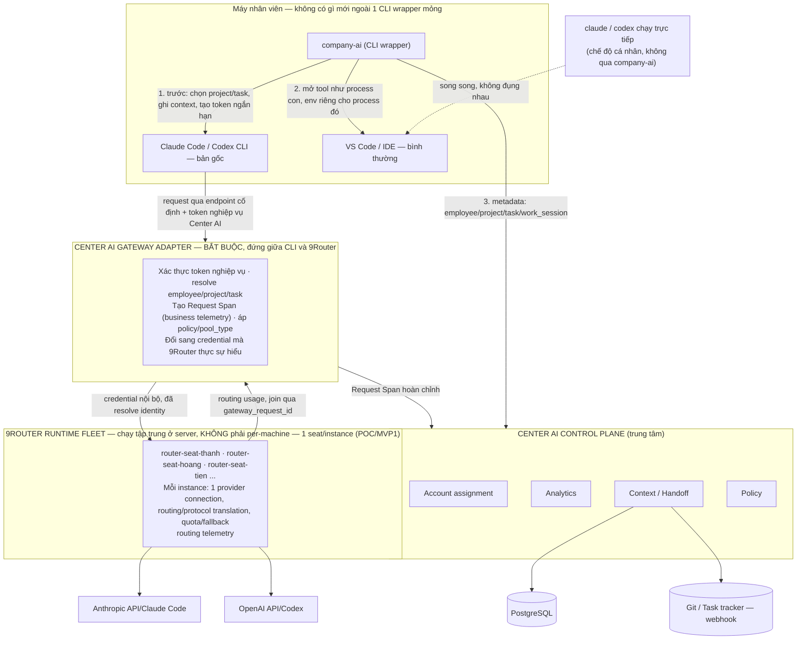
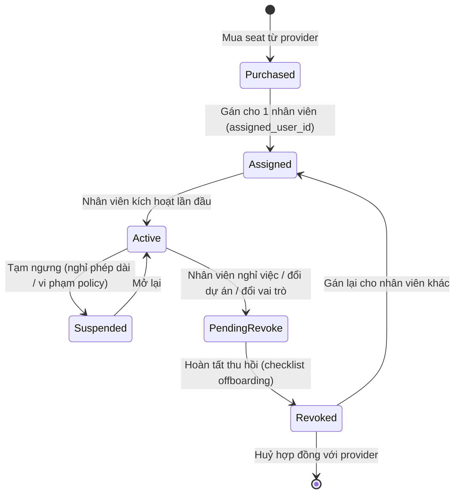
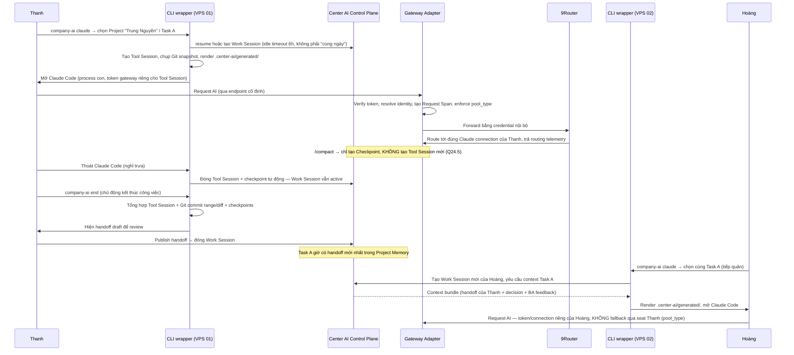

# AI Operations Center: quản trị seat hợp lệ, observability và project memory cho doanh nghiệp

> **🔒 v16 — dọn API/security contract lần cuối, kiến trúc không đổi.** Đổi API domain từ `/v1/agent/*` sang resource-style (`/v1/work-sessions`, `/v1/tool-sessions/{id}/checkpoints`...) vì không còn "Agent" service nào cần route riêng. `CENTER_AI_*` env var chính thức là metadata tiện dụng, KHÔNG phải nguồn tin — Adapter chỉ tin claim trong token đã ký, lệch thì token thắng và request bị gắn cờ. Routing/token đổi từ `employee_id` sang `seat_id` (1 người có thể có nhiều seat: Claude/Codex/shared API). `context_hash` lệch giờ có 2 mức: `stale_warn` (không nghiêm trọng, cho qua + cảnh báo) và `hard_block` (policy/security, chặn ngay) — tránh chặn cứng nhân viên giữa phiên vì một thay đổi không liên quan. Diagram/Q24.1 đã đồng bộ tên "9Router Runtime Fleet" và ghi rõ container-per-seat chỉ là chiến lược POC/MVP1.
> Mô hình: seat AI (Claude, ChatGPT, v.v.) được mua **hợp lệ**, **1 seat = 1 nhân viên cố định, không rotate, không chia sẻ**. VPS/local node đa dạng chỉ vì lý do vận hành — bảo mật — môi trường làm việc, không phải để né phát hiện hay chia sẻ account.

---

## 0.0 Changelog v3 — phản biện vòng review thứ hai (GPT)

Tài liệu này được một bên thứ hai (GPT) review và chấm 8.5-9/10 dưới góc độ Solution Architecture, kèm 6 đề xuất mở rộng dưới góc CEO/startup. Dưới đây là kết quả tranh luận — không nuốt trọn, có tiếp thu, có phản biện.

| Đề xuất của GPT | Quyết định | Lý do |
|---|---|---|
| AI Knowledge Graph (Company-wide, không chỉ Project Memory) | **Tiếp thu — mở rộng entity model** (Q11) | Đúng là thiếu `customer`/`meeting`/`document`/`incident`. Nhưng **không đồng ý** "phải là graph DB" — schema Postgres có FK rõ ràng đã là graph về mặt khái niệm; graph DB vật lý (Neo4j) chỉ cần khi có nhu cầu truy vấn đa chặng đã được chứng minh, không phải mặc định |
| Intent thay vì Prompt làm trung tâm | **Tiếp thu toàn bộ** (Q12) | Đúng hướng, khớp tự nhiên với `project_context` đã thiết kế sẵn |
| AI Governance đầy đủ (Data Classification, Secret Scan, PII, Risk Score) | **Tiếp thu — tách thành pillar riêng** (Q13) | Bản trước có nhắc secret/PII ở Q8 nhưng quá mỏng, chưa có Risk Score |
| AI Employee / Digital Employee (persona có memory/role/permission) | **Tiếp thu một phần — đưa vào tầng Vision** | Là lớp persona xây *trên* Context Service đã có, không phải hệ thống mới; chưa nên vào MVP |
| Workflow Engine (Customer→...→Close) | **Không đồng ý xây mới — "workflow-aware" thay vì workflow engine** | Tự xây workflow engine là đấu trực diện với Jira/Linear/ServiceNow. Tích hợp qua webhook để biết giai đoạn, bơm context/policy theo giai đoạn — đạt cùng mục tiêu, không tự sát vào scope |
| AI Marketplace (Marketing/Sale/BA/Dev Agent...) | **Từ chối cho roadmap gần** | Marketplace hai chiều là mô hình kinh doanh khác hẳn (discovery, permission, billing riêng) — rủi ro loãng focus cao nhất trong toàn bộ danh sách, nên làm sau khi moat (Project Continuity) đã chứng minh với khách thật |
| Đổi tên → "Enterprise AI Operating System" | **Tiếp thu cho tầng positioning, không đổi kiến trúc** | Ẩn dụ tốt để bán, nhưng là quyết định marketing — không nên vì "OS cần Marketplace" mà đẩy các module rủi ro vào MVP sớm |

### Vòng phản biện thứ ba (GPT, sau khi đọc v3) — chấm 9.3-9.5/10

| Đề xuất của GPT | Quyết định | Lý do |
|---|---|---|
| AI Timeline (chuỗi sự kiện theo thời gian) | **Tiếp thu — derived view, không phải hệ thống mới** (Q14) | Chỉ là sắp xếp theo thời gian trên các bảng Q11 đã có |
| AI Replay (tóm tắt phiên làm việc theo yêu cầu) | **Tiếp thu một phần — hợp nhất vào Handoff (Q5), không tách riêng** | Về bản chất là Handoff đã có, chỉ đổi UX từ "tự động lưu" thành "bấm xem theo yêu cầu, nhiều mức zoom" |
| Context Confidence (confidence/freshness/owner/expires) | **Tiếp thu — mở rộng `project_context`** (Q15) | 80% đã có (version/approved_by/valid_to) ở v2-v3, thiếu phần hiển thị confidence tại thời điểm inject |
| AI Reasoning Log (Intent→Evidence→Reasoning→Decision→Outcome) | **Tiếp thu — đây là pattern ADR đã chuẩn hoá trong ngành** (Q15) | Không phải ý tưởng mới, là Architecture Decision Record — mở rộng `project_context type=decision` |
| Multi-Project Memory / Knowledge Reuse | **Tiếp thu có điều kiện bắt buộc — tách pattern library khỏi customer memory** (Q16) | Ví dụ GPT đưa ra (Trung Nguyên/Highlands) là 2 đối thủ cạnh tranh trực tiếp — reuse tự động giữa 2 khách là rủi ro rò rỉ thông tin cạnh tranh, không phải tính năng hay nếu không có gate |
| Company Brain 5 tầng (Company/Department/Project/Personal/Session) | **Tiếp thu — thêm `scope_level` vào context đã có** (Q16) | Mở rộng hợp lý, không phải infra mới |
| AI Inbox (digest buổi sáng) | **Tiếp thu mạnh — differentiator thật** (Q14) | Đây là feature khiến sản phẩm thành thói quen mở mỗi sáng — giá trị cao, chi phí thấp vì chỉ là Timeline lọc cá nhân + gợi ý |
| Đổi tên → "AI Workspace OS" / "Enterprise AI Platform" | **Tiếp thu — chọn "Enterprise AI Platform"** | "Operating System" đúng là quá lớn so với scope thật, tự GPT cũng nhận ra ở vòng này |
| Đảo pitch — Project Continuity lên đầu, Seat xuống cuối | **Tiếp thu toàn bộ** | Khớp đúng kết luận đã chốt ở v3 |

### Chốt v5 — sửa lỗi cuối cùng, không qua GPT (người dùng tự quyết, khoá tài liệu)

| Vấn đề | Quyết định | Lý do |
|---|---|---|
| Kết luận v3/v4 "9Router nên xây lại thành Workstation Agent" | **Sửa — hai lớp song song, không thay thế nhau** (Q9) | 9Router (kết nối tool/model tại node) và Workstation Agent (biết ai/dự án/task) là hai trách nhiệm khác nhau. 9Router mã nguồn mở, đang dùng ổn thì giữ hoặc trích tính năng ra dùng, không đập đi xây lại |
| Roadmap MVP1 dẫn đầu bằng Seat registry | **Sửa thứ tự** | Thứ nên code đầu tiên là chọn project/task → context bundle → CLAUDE.md → session tracking → git-aware handoff → tiếp quản — đây là phần chứng minh giá trị thật, không phải seat management |
| Chưa có đặc tả POC thực thi được | **Thêm mục 15 — POC Spec một luồng duy nhất** | Khoá phạm vi bằng một demo cụ thể (Thanh/Hoàng, `center-ai start`/`end`) thay vì danh sách hạng mục trừu tượng |

Sau chốt này, tài liệu dùng làm **architecture vision** — không thêm ý tưởng mới, chuyển sang thực thi POC (mục 15).

### v6 — vá khoảng cách 9.5 → 10: cơ chế vận hành cụ thể (Q17-Q21)

Câu trả lời cho "làm sao đạt 10/10": khoảng cách không nằm ở thêm subsystem, mà ở việc các cơ chế nền tảng (Q1-Q16) chưa đủ cụ thể để một kỹ sư implement mà không phải đoán — cụ thể là 5 câu hỏi vận hành: phân biệt session khi dùng CLI/IDE và làm nhiều dự án cùng lúc trên 1 máy, tương tác giữa context window compaction (`/compact`) của tool và Project Memory, quyền xem toàn bộ cho chủ doanh nghiệp, công thức KPI/chi phí cụ thể thay vì đếm token thô, và context injection đa nền tảng qua 9Router. Chốt luôn quan điểm gốc: **session gắn theo process tree (shell/terminal), không gắn theo nhân viên hay theo máy** — đây là nguyên lý giải quyết gọn hầu hết các câu hỏi tưởng như rời rạc.

### v7 — sửa lỗi tư duy: "session" là 4 lớp, không phải 1 khái niệm phẳng (Q17-Q22)

Bản v6 (Q17-Q21 cũ) tuy đúng nguyên lý process-tree nhưng vẫn coi "session" là một khái niệm duy nhất, và dùng biến môi trường thô để truyền định danh — không phân biệt được (a) phiên công việc xuyên suốt nhiều lần mở/đóng CLI trong ngày, (b) phiên của riêng một lần chạy tool, (c) điểm chụp nhanh ngữ cảnh, (d) một lượt gọi API — và cơ chế truyền định danh có thể bị giả mạo. Sửa toàn bộ bằng **Work Session / Tool Session / Checkpoint / Request Span** (Q18) + token đã ký (thay vì env var thô), bổ sung Task claim/lease thật (Q20, POC chỉ cần cảnh báo mềm), Coverage Matrix nói thẳng giới hạn từng bề mặt (Q21), và tách Metadata Mode / Full Audit Mode có thời hạn thay vì vai trò Owner tĩnh (Q22). Q17-Q21 cũ đã được thay thế hoàn toàn bằng Q17-Q22 mới — không giữ song song 2 bản để tránh mâu thuẫn.

---

## 0. Điều chỉnh so với bản phân tích trước

Bản trước đọc "context pool + chuyển sang account khác khi hết quota" thành cơ chế luân phiên account giữa nhiều nhân viên, nên đánh giá theo hướng rủi ro ToS/ban. Giả định đúng: mỗi seat gắn cố định với một nhân viên. Toàn bộ phần "rủi ro bị khoá tài khoản" của bản trước không áp dụng cho mô hình này. Câu hỏi trọng tâm bây giờ: **quản trị cái gì đã mua hợp lệ, như thế nào** — không phải "có an toàn để làm không".

---

## 1. AI Operations Center là gì

Bốn năng lực, không cái nào mới về bản chất quản trị — chỉ mới vì đối tượng quản trị là seat AI thay vì laptop hay license Office.

| Năng lực | Tương tự đã quen thuộc | Câu hỏi nó trả lời |
|---|---|---|
| **1. AI Seat & Resource Management** | Quản lý license M365, Copilot seat, tài sản laptop | Ai đang giữ seat nào, thuộc phòng ban/dự án nào, còn hạn không |
| **2. AI Work Observability** | Jira activity log, AWS CloudTrail | Seat đang dùng cho việc gì, phiên nào thuộc task nào |
| **3. Shared Project Context** | Confluence + Jira, nhưng chủ động đẩy chứ không chờ tra cứu | Người tiếp quản hiểu ngay dự án tới đâu mà không cần hỏi lại |
| **4. Company Operating Framework** | Onboarding checklist, coding standard, security policy hiện có | Nhân viên mới/AI agent làm đúng quy trình công ty ngay từ phiên đầu |

Năng lực 3 và 4 **chủ động đẩy** vào phiên làm việc thay vì nằm chờ tra cứu — đây là phần khó nhất và là giá trị cốt lõi, không phải phần quản lý seat (vốn là bài toán CRUD quen thuộc).

---

## 2. Kiến trúc tổng thể

**Chốt cuối cùng (Q24): 4 lớp — CLI wrapper (máy nhân viên), Center AI Gateway Adapter (bắt buộc, server), 9Router Runtime Fleet (server, nhiều instance — 1 seat/instance, xem Q9), Center AI Control Plane (server).** 9Router chạy tập trung ở server công ty — không cài node trên từng máy nhân viên. Gateway Adapter không phải "một phần nhỏ bên trong" Control Plane hay 9Router — nó là lớp riêng, bắt buộc, đứng giữa CLI và Fleet (chi tiết Q9). Máy nhân viên không có gì mới ngoài một CLI wrapper mỏng; VS Code, Claude Code, Codex CLI vẫn là bản gốc, không fork, không desktop app riêng.

**Lưu ý thứ tự — Control Plane không phải hop cuối trên đường đi của request AI**, nó quản lý song song (cấp session/context/assignment, nhận telemetry), không nằm nối tiếp sau 9Router:

```
                    Center AI Control Plane
                    ↙ (session/context/assignment)   ↘ (nhận telemetry)
CLI wrapper  →  Gateway Adapter  →  9Router  →  Provider
```



CLI wrapper **không nằm trên đường đi của traffic AI như một proxy đọc nội dung** — nó chỉ chuẩn bị context/token trước, mở tool như tiến trình con, và đọc lại Git diff/checkpoint sau. **Gateway Adapter là lớp bắt buộc, không phải tuỳ chọn** — 9Router không có sẵn domain model employee/project/task/Work Session của Center AI, nên không thể nhận thẳng token nghiệp vụ; Adapter xác thực token đó rồi mới đổi sang credential mà 9Router thực sự hiểu (chi tiết Q24, sửa lại từ bản trước vốn cho CLI nói thẳng với 9Router — đó là lỗi).

---

## Q1. Quản lý seat theo nhân viên, phòng ban, máy, dự án

Mô hình seat là **state machine**, không phải một dòng dữ liệu tĩnh:



Mỗi lần chuyển trạng thái ghi vào `seat_events` (ai duyệt, khi nào, lý do).

Một seat gắn **4 chiều quan hệ** cùng lúc, mỗi chiều một bảng riêng để không mất lịch sử khi thay đổi:

- `seat_assignments` — lịch sử ai giữ seat này qua thời gian (không ghi đè, chỉ đóng bản ghi cũ + mở bản ghi mới).
- `seat_department_link` — phòng ban tại thời điểm gán.
- `seat_machine_link` — máy/VPS nào seat này đang hoạt động.
- `seat_project_link` — seat được cấp chủ yếu phục vụ dự án nào (dùng lập ngân sách, không ràng buộc kỹ thuật cứng).

Quy trình cấp/thu hồi nên là **workflow có duyệt**: quản lý trực tiếp yêu cầu → admin AI Ops duyệt → hệ thống ghi nhận + gửi hướng dẫn kích hoạt. Thu hồi khi nghỉ việc nên nối vào quy trình offboarding chung đã có (cùng lúc thu hồi laptop, email, VPN), không tách riêng.

---

## Q2. Đo quota đã dùng/còn lại khi mỗi provider cung cấp dữ liệu khác nhau

Giới hạn thật từ phía provider, không phải giới hạn thiết kế — thiết kế theo **3 tầng độ tin cậy giảm dần**:

| Tầng | Nguồn dữ liệu | Độ chính xác | Áp dụng khi |
|---|---|---|---|
| **1 — Provider Admin/Usage API** | API quản trị chính thức (nếu gói Enterprise/Team có cấp) | Cao nhất — số token/request thật | Provider có admin console cấp API (thường chỉ Business/Enterprise) |
| **2 — Ước lượng phía CLI wrapper** | CLI đếm số phiên/độ dài tương tác cục bộ (không đọc nội dung) | Tương đối — đủ so sánh xu hướng | Provider không cấp API usage cho gói đang dùng |
| **3 — Tự khai báo / export thủ công** | Admin console export định kỳ, hoặc nhân viên tự báo cáo | Thấp, có độ trễ | Không có API lẫn agent quan sát được |

**Cần kiểm chứng bằng POC, không giả định trước**: khả năng cấp API usage theo seat thay đổi liên tục giữa các provider/gói. Đừng thiết kế cứng phụ thuộc một API cụ thể — để hệ thống tự "rơi" xuống tầng thấp hơn khi provider không hỗ trợ, tự nâng lên khi có API mới, mà không cần đổi kiến trúc.

---

## Q3. Thu thập session metadata hợp lệ từ Web, CLI, IDE, API

Mỗi bề mặt có một điểm mở chính thức riêng:

| Bề mặt | Cơ chế thu thập | Ghi chú |
|---|---|---|
| Web (Claude.ai, ChatGPT web) | Browser extension công ty tự triển khai, công khai | Đọc DOM/local state phiên chat trong trình duyệt của chính nhân viên |
| CLI (Claude Code) | Hooks/plugin chính thức Claude Code hỗ trợ | Điểm mở do provider cung cấp, không phải can thiệp không chính thức |
| IDE (Cursor, VSCode…) | Extension API của IDE | Chạy trong tiến trình IDE, đọc sự kiện phiên do IDE phát ra |
| API-managed workload | Chính gateway (LiteLLM/Portkey) | Không cần thu thập thêm — gateway vốn đã thấy toàn bộ request/response |

Mẫu số chung bắt buộc: nhân viên **chủ động chọn project + task** trước khi bắt đầu phiên, và banner thông báo rõ dữ liệu nào được ghi nhận — không có cơ chế nào "ngầm" bật.

---

## Q4. Gắn AI usage với project, task, commit, PR và kết quả thực tế

Hai cơ chế bổ sung nhau, **sửa lại cho khớp Q24.8** (bản trước dùng commit trailer làm cơ chế chính — đã đổi sang Git snapshot tự động):

- **Đầu Tool Session (tự động)**: CLI chụp snapshot — `HEAD` hiện tại, branch, working tree, repo path — không cần dev khai báo gì.
- **Checkpoint / `company-ai end` (tự động)**: CLI tự tính commit range (`git log <start_head>..HEAD`), diff, changed files từ snapshot đã chụp.

Commit trailer (`Session-Id: ...`) chỉ còn là **fallback/audit aid**, không bắt buộc — dev không cần nhớ gõ gì thêm khi commit. Kết quả thực tế (task hoàn thành, PR merged, review pass) lấy trực tiếp từ task tracker/Git — hệ thống AI Ops không tự đánh giá "kết quả tốt hay xấu", chỉ nối dữ liệu đã có sẵn.

---

## Q5. Shared project memory để người khác tiếp quản công việc

3 nguyên tắc cốt lõi:

1. **Postgres là nguồn sự thật**, mỗi bản ghi có `type` rõ ràng: `requirement`, `decision`, `ba_feedback`, `status`, `known_issue`, `next_step`, `handoff`, `code_context`, `customer_feedback`.
2. **Vector DB chỉ là chỉ mục truy hồi**, luôn trỏ ngược về bản ghi gốc kèm nguồn và thời điểm.
3. **Sinh handoff tự động cuối phiên** (tóm tắt bằng LLM từ nội dung phiên + commit liên quan), không phụ thuộc người trước "nhớ" phải viết bàn giao.

Vì mỗi seat cố định 1 người, **context là thứ duy nhất di chuyển giữa người với người** — không có tình huống "context đi kèm account". Điều này đơn giản hoá Context Service so với mô hình account dùng chung.

---

## Q6. Inject context vào Claude/ChatGPT/Claude Code/Cursor mà không chia sẻ account

Không có bài toán "inject vào một phiên đã tồn tại" — có bài toán dễ hơn: **chuẩn bị sẵn ngữ cảnh trước khi nhân viên tự mở phiên bằng seat của họ**, tận dụng cơ chế ngữ cảnh gốc mà từng công cụ đã hỗ trợ sẵn:

| Công cụ | Cơ chế ngữ cảnh có sẵn | CLI wrapper làm gì |
|---|---|---|
| Claude Code | File `CLAUDE.md` đọc tự động khi khởi động phiên | `company-ai init` thêm marker vào `CLAUDE.md` **một lần duy nhất**; các lần chạy `company-ai claude` sau chỉ ghi vào `.center-ai/generated/`, không đụng lại `CLAUDE.md` (chi tiết cơ chế marker ở Q24.6) |
| Cursor / IDE | File rule/context nội bộ (`.cursorrules`/`AGENTS.md`) | Tương tự — marker 1 lần qua `company-ai init`, nội dung động nằm ở `.center-ai/generated/` |
| Claude.ai / ChatGPT web | Không có file dự án — nhưng có ô nhập đầu tiên | Extension chèn sẵn khối "Ngữ cảnh dự án" vào đầu ô soạn tin nhắn, nhân viên xem/chỉnh sửa trước khi gửi (bề mặt riêng, ngoài phạm vi POC hiện tại — Q23) |
| Internal chat / API workload | System prompt do hệ thống dựng | Gateway/app tự ghép context bundle vào system prompt lúc build request |

Trong mọi trường hợp, **nhân viên vẫn là người bấm gửi** bằng chính phiên đăng nhập của họ. CLI wrapper chỉ chuẩn bị nguyên liệu, không tự động hoá hành động gửi thay họ — giữ ranh giới "quan sát và chuẩn bị", không "thay mặt hành động".

---

## Q7. Quản lý unclassified usage và phát hiện dùng sai mục đích

**Unclassified usage:**
- Phiên không gắn `project_id`/`task_id` vẫn được ghi nhận bình thường (không chặn công việc), đánh dấu `unclassified`.
- Báo cáo tuần cho quản lý trực tiếp: tỷ lệ phiên unclassified theo nhân viên — dùng để nhắc nhở quy trình, không trừng phạt tự động.
- Tỷ lệ cao kéo dài thường là dấu hiệu UX chọn project/task đang gây khó chịu hơn là nhân viên cố tình.

**Phát hiện dùng sai mục đích** — ưu tiên tín hiệu dựa trên metadata trước khi đọc nội dung:
- Mẫu hình bất thường: khối lượng vượt xa trung bình vai trò tương đương, không gắn project/task trong thời gian dài.
- Sai phạm vi phòng ban/dự án: seat cấp cho dự án A nhưng usage tập trung ở dự án không liên quan.
- Chỉ khi ≥2 tín hiệu metadata mới đưa vào diện xem xét thủ công bởi người có thẩm quyền — không tự động kết luận, không tự động phạt.

---

## Q8. Quyền riêng tư, thông báo giám sát, retention, quyền truy cập quản lý

| Vai trò | Thấy được gì | Không thấy được gì |
|---|---|---|
| Nhân viên (chủ phiên) | Toàn bộ dữ liệu của chính mình | — |
| Quản lý trực tiếp | Số liệu tổng hợp theo team, danh sách phiên bị gắn cờ | Nội dung prompt/response thô, trừ quy trình leo thang có lý do + được duyệt |
| **Owner / Ban điều hành** (xem Q19) | **Nội dung thô toàn công ty khi cần** — quyền business-level, khác Admin AI Ops | — nhưng mọi lần truy cập đều ghi `audit_logs`, kể cả của chính Owner |
| Admin AI Ops | Cấu hình hệ thống, seat registry, policy | Nội dung prompt/response thô (mặc định) |
| Auditor | Audit log (ai làm gì, khi nào) | Không có quyền ghi bất kỳ dữ liệu nghiệp vụ nào |

**Thông báo giám sát**: banner một trang, rõ ràng (dữ liệu gì, ai xem, lưu bao lâu, mục đích gì), hiển thị lúc cài CLI wrapper/extension lần đầu, không chôn trong điều khoản dài.

**Retention theo tầng**: nội dung thô (nếu có lưu) — hạn ngắn; metadata (project/task/token/cost) — dài hạn; audit log — theo yêu cầu compliance.

---

## Q9. Ba thành phần, ba trách nhiệm — CLI wrapper, Gateway Adapter, 9Router

**Sửa lại lần nữa (lỗi nền móng phát hiện ở vòng review thứ năm)**: bản v9 vẫn cho CLI phát token nghiệp vụ Center AI rồi Claude Code gửi thẳng token đó tới 9Router, ngầm giả định 9Router tự hiểu được `employee_id/project_id/task_id`. **Sai** — 9Router là router cho provider/quota/protocol, không có sẵn domain model nghiệp vụ của Center AI. Thiếu một lớp bắt buộc ở giữa.

```
Center AI Control Plane (trung tâm)
   ↓
CLI wrapper mỏng trên máy nhân viên     — biết ai, repo nào, task nào — CẦN XÂY MỚI, nhẹ
   ↓ (mở tool AI như process con, endpoint cố định + token nghiệp vụ)
Center AI Gateway Adapter (server)      — xác thực token, resolve identity, tạo Request Span,
                                           áp policy/pool_type, đổi sang credential 9Router hiểu — BẮT BUỘC, CẦN XÂY MỚI
   ↓
9Router Runtime Fleet (chạy tập trung ở server, NHIỀU instance)   — giữ connection, routing, protocol translation — TÁI DÙNG NẾU ỔN
   ↓
Claude / GPT / provider
```

**Đổi tên "Central 9Router" → "9Router Runtime Fleet"** (sửa lại do v14 tự mâu thuẫn: đã chốt container-per-seat tức nhiều instance, không còn "một cái 9Router trung tâm" theo nghĩa số ít).

**CLI wrapper** — cần xây mới, cố tình làm mỏng: nhận diện nhân viên, đọc Git root xác định project, cho chọn task, kéo context bundle, mở tool như tiến trình con với token nghiệp vụ ngắn hạn, sau khi tool thoát chụp Git diff/checkpoint.

**Gateway Adapter** — cần xây mới, đây là phần trước đây bị bỏ sót: xác thực token nghiệp vụ (không phải credential provider thật) → resolve `employee_id/project_id/task_id/work_session_id` → **kiểm tra `seat_id` có đang gán cho `employee_id` này không, `tool`/`provider` có được phép theo seat đó không** (một nhân viên có thể có nhiều seat — Claude seat, Codex seat, company shared API — nên không route chỉ bằng `employee_id`) → tra **Seat Runtime Registry** (bên dưới) theo `seat_id` để biết đúng instance → tạo `request_id` riêng, sở hữu **business telemetry** → forward sang đúng instance 9Router bằng credential mà nó thực sự hiểu (API key/session per connection, tuỳ 9Router hỗ trợ gì — cần đọc docs/source thật để xác nhận, không suy đoán).

**9Router Runtime Fleet** — hạ tầng kết nối, giữ nguyên nếu đang chạy tốt: mỗi instance giữ 1 provider connection, route model/provider, protocol translation, quota/fallback ở mức **routing telemetry**. Không tự suy luận project/task. Hai loại telemetry (business từ Adapter, routing từ Fleet) join qua `gateway_request_id` — không đặt cược vào việc Fleet tự đẩy đủ dữ liệu nghiệp vụ về Center AI, vì chưa chắc nó có webhook đúng dạng cần.

> **Cần verify, không suy đoán**: liệu 9Router có native hỗ trợ OAuth/subscription provider (Claude Code, Codex) ổn định, hay thiết kế gốc thiên về self-hosted/cá nhân — chỉ xác nhận được bằng cách đọc docs/source thật và test (Q23, Q24.10 Bước 0), không khẳng định trước.

### Cách enforce `pool_type=PERSONAL_ASSIGNED` — cô lập bằng hạ tầng, là chiến lược cho POC/MVP1, KHÔNG phải mô hình scale vĩnh viễn

Thay vì tin vào việc 9Router *được cấu hình đúng* để không route chéo seat, POC dùng **1 seat = 1 container/instance riêng**, mỗi container giữ đúng 1 OAuth/subscription session trong volume riêng, expose 1 internal port riêng:

```
Server AI Gateway
├── 9Router instance Thanh  (volume OAuth riêng)  → internal port router-thanh:20128
├── 9Router instance Hoàng  (volume OAuth riêng)  → internal port router-hoang:20128
└── 9Router instance Tiên   (volume OAuth riêng)  → internal port router-tien:20128
```

Container của Thanh **không có quyền truy cập** credential của Hoàng — cô lập vật lý, mạnh hơn nhiều so với "cấu hình để không fallback".

**Seat Runtime Registry** — Gateway Adapter tra registry này để route, Control Plane sở hữu vòng đời (nối vào state machine seat đã có ở Q1: `assigned` → tạo container/attach volume; `suspended` → tạm dừng; `revoked` → destroy):

```json
{
  "seat_claude_thanh": {
    "employee_id": "emp_thanh",
    "endpoint": "http://router-thanh:20128",
    "status": "healthy"
  }
}
```

Control Plane quản lifecycle: `create container → attach encrypted OAuth volume → health check → suspend → restart → revoke → destroy`. Gateway Adapter chỉ đọc registry để route, không tự quản lý container.

**Sửa lại: đây KHÔNG phải kiến trúc cuối cùng.** Ở quy mô 500-1.000 seat, container-per-seat nghĩa là 1.000 container + 1.000 volume + 1.000 health check + 1.000 vòng đời OAuth refresh — vẫn chạy được về kỹ thuật nhưng chi phí vận hành tăng mạnh. Sau khi POC chứng minh luồng đúng, có 2 hướng tối ưu tại MVP3 trở đi, **chỉ làm khi có bằng chứng cụ thể cần thiết, không làm trước**:
- 1 instance dùng chung nhiều isolated credential profile, Adapter ép `connection_id`, router không được thấy connection ngoài phạm vi employee (rủi ro hơn vì phải sửa routing engine — Phương án tối ưu về sau, không phải mặc định).
- Chia shard: 1 router worker quản lý 20-50 seat, vẫn giữ isolation bằng credential store + policy riêng từng seat trong shard.

### Adapter mặc định KHÔNG sửa nội dung request — chỉ 2 chế độ, chế độ 1 là mặc định

**Sửa lại v14**: bản trước nói Adapter tiêm một khối nhỏ (identity/policy/`context_bundle_id`) vào system prompt/header của *mọi* request — đi hơi xa. Phần lớn dữ liệu đó (`employee_id`, `work_session_id`, `tool_session_id`, `context_bundle_id`, `context_hash`, `connection_id`) là **metadata phục vụ xác thực/thống kê, model không cần thấy và không nên tốn token cho nó**. Tách 2 chế độ rõ ràng:

| Chế độ | Khi nào | Cơ chế | Có sửa body không |
|---|---|---|---|
| **Metadata enforcement (mặc định)** | Mọi request | Metadata nằm trong signed token/internal header, Adapter verify claims + kiểm `context_hash` khớp bundle mới nhất ở server — **không đụng vào body** | Không — request đi qua gần như nguyên vẹn |
| **Prompt enforcement (tuỳ chọn, hiếm)** | Chỉ khi có policy bắt buộc model phải nhìn thấy, và không thể tin tưởng local context (vd rule chống xoá) | Adapter parse/sửa body theo định dạng provider, chèn đúng phần rule cần thiết | Có — chỉ bật khi thật sự cần |

Quy tắc: rule mà model cần tuân theo (không sửa migration cũ, không đưa dữ liệu khách hàng ra ngoài, chỉ dùng TypeScript strict...) **ưu tiên nằm local** trong `company.md`/`team.md`/`project.md` (Q19) như thiết kế gốc — chỉ chuyển sang Prompt enforcement khi công ty không chấp nhận rủi ro nhân viên xoá/sửa local context. Mặc định Metadata-only giảm đáng kể rủi ro spike: không chạm body nghĩa là không có nguy cơ phá prompt caching, không phá định dạng Claude Code, không cần parse mọi request ngay từ MVP 0.

---

## Q10. Kiến trúc MVP không phụ thuộc API chưa tồn tại

5 cơ chế đã chắc chắn có ở mọi provider/tool ngay hôm nay:

1. **Seat registry thủ công** — CRUD thuần Postgres, không cần tích hợp provider.
2. **CLAUDE.md/.cursorrules auto-injection** — chỉ cần quyền ghi file cục bộ.
3. **Git snapshot & repository state linking** — CLI tự chụp HEAD/branch/commit range, không cần dev thao tác gì (sửa lại theo Q24.8 — trailer chỉ còn là fallback).
4. **Gateway cho API-managed workload** — dùng API key thật đã có.
5. **Browser extension tự nguyện** — quan sát phiên web, không cần admin API.

Tầng "Provider Admin/Usage API" ở Q2 luôn là **nâng cấp tuỳ chọn** gắn thêm sau, không phải điều kiện tiên quyết để MVP chạy được.

---

## Q11. Company Knowledge Graph — mở rộng Project Memory

GPT đúng: Project Memory hiện tại (bản v2) mới dừng ở `project_context` gắn với `project`/`task` — thiếu hẳn `customer`, `meeting`, `document`, `incident`. Ví dụ cần trả lời được: *"Khách A từng complain gì → từ meeting nào → BA tạo task nào → sửa file nào → commit/PR nào → deploy hôm nào → có phát sinh incident không"* — chuỗi này đi qua 7 loại thực thể, hiện schema chỉ phủ 4.

**Mở rộng entity model** (không phải công nghệ mới, chỉ là thêm bảng + FK vào đúng schema Postgres đã có — xem mục 14):

```
customers → meetings → project_context(type=customer_feedback|decision) → tasks → git_links → incidents
```

**Về việc có cần graph database không — tách bạch hai câu hỏi khác nhau:**

| Câu hỏi | Trả lời |
|---|---|
| Dữ liệu có cấu trúc dạng graph (nhiều thực thể, nhiều loại quan hệ) không? | **Có** — luôn đúng cho dữ liệu doanh nghiệp, không liên quan gì đến việc chọn công nghệ lưu trữ |
| Có cần một graph database vật lý (Neo4j, Memgraph...) để lưu nó không? | **Chưa chắc** — chỉ cần khi truy vấn thực tế là đa chặng, độ sâu không cố định (vd "tìm mọi incident cách task X không quá 4 bước quan hệ") mà SQL/CTE đệ quy trên Postgres không đáp ứng đủ nhanh |

Khuyến nghị: **giữ Postgres với FK tường minh + recursive CTE cho truy vấn đa chặng ở MVP2-3**. Chỉ đánh giá chuyển sang graph DB riêng khi có bằng chứng cụ thể (độ trễ truy vấn, độ phức tạp query) từ dữ liệu thật — không chuyển trước vì "nghe có vẻ đúng cho Enterprise". Đây là nguyên tắc chung nên áp dụng cho mọi lựa chọn hạ tầng trong tài liệu này: công nghệ đi theo bằng chứng, không đi theo ấn tượng.

---

## Q12. Intent-centric thay vì Prompt-centric

Bản v2 vẫn coi `prompts`/`responses` là thực thể trung tâm của tầng Observability. GPT chỉ đúng một điểm quan trọng: **prompt là chi tiết triển khai, không phải thứ đáng lưu làm trung tâm** — vì mai đổi model, đổi cách diễn đạt prompt, nhưng ý định công việc (intent) và kết quả (outcome) thì không đổi.

**Thêm lớp trung gian `intents`** giữa `sessions` và `project_context`:

```
session → intent (mục tiêu công việc, độc lập model/prompt) → outcome (code, PR, document, decision)
                ↑
         prompt/response (evidence — bằng chứng thô, phục vụ audit/secret-scan, KHÔNG phải trung tâm)
```

Hệ quả thiết kế:
- `prompts`/`responses` vẫn được lưu (cần cho Q13 — secret scan, PII, audit) nhưng vai trò đổi thành **bằng chứng đính kèm** một `intent`, không phải bản ghi chính.
- Truy hồi context (Q5) và phân tích hiệu quả nên query theo `intent` + `outcome`, không query theo nội dung prompt — nhờ vậy đổi provider/model không làm vỡ lịch sử phân tích.
- Một `intent` có thể sinh ra nhiều `prompt` (thử lại, đổi model) nhưng vẫn là 1 đơn vị công việc — giải quyết đúng vấn đề "đếm token/prompt không phản ánh hiệu quả" đã nêu ở bản v1.

---

## Q13. AI Governance đầy đủ

Bản v2 gộp bảo mật vào Q8 (quyền truy cập) khá sơ sài. Tách thành pillar riêng:

```
Data Classification → Secret Scan → PII Detection → Approval (nếu cần) → Audit → Risk Score
```

**Sửa lại theo Q9/Q24**: tài liệu không còn "Workstation Agent chạy nền chặn mọi request" — chỉ còn CLI wrapper (gọi theo lệnh, không thường trú) và Gateway Adapter (nằm trên đường đi traffic AI khi qua gateway). Vì vậy nơi chạy governance khác nhau theo loại dữ liệu:

| Bề mặt | Nơi thực thi | Vì sao |
|---|---|---|
| Request AI qua gateway (Claude Code/Codex qua Adapter) | **Gateway Adapter** thực thi policy trước khi forward sang 9Router | Adapter là nơi duy nhất thật sự nằm trên traffic ở kiến trúc mới (Q9) |
| File/context cục bộ (trước khi CLI upload/inject vào context bundle) | CLI hoặc hook riêng của tool, nếu tool có hỗ trợ | CLI wrapper không thường trú, không chặn được mọi prompt trong mọi tool — chỉ scan được thứ nó thực sự chạm vào |

Không khẳng định chặn được 100% nội dung ở mọi tool — governance đầy đủ (toàn bộ bảng dưới) vẫn là hạng mục MVP sau, không phải POC.

| Bước | Cơ chế | Hành vi khi vi phạm |
|---|---|---|
| Data Classification | Gắn nhãn nội dung theo pattern (mã nguồn nội bộ / dữ liệu khách hàng / công khai) trước khi cho phép gửi | Cảnh báo theo nhãn, một số nhãn bắt buộc duyệt trước |
| Secret Scan | Pattern kiểu gitleaks (AWS key, API key, private key...), chạy tại Gateway Adapter cho traffic qua gateway | **Chặn cứng** — không cho gửi, không có ngoại lệ |
| PII Detection | Regex + model nhỏ nhận diện CCCD, hộ chiếu, số thẻ, dữ liệu khách hàng dạng bảng | Chặn hoặc cảnh báo tuỳ mức nhạy cảm theo policy phòng ban |
| Approval | Một số loại nội dung (vd dữ liệu khách hàng thật) cần người có thẩm quyền duyệt trước khi AI xử lý | Giữ phiên ở trạng thái chờ, không tự động tiếp tục |
| Audit | Mọi lần chặn/cảnh báo/duyệt ghi vào `audit_logs` | Không thể xoá, phục vụ điều tra sau này |
| Risk Score | Điểm tổng hợp theo employee/project, cộng dồn từ số lần bị chặn, mức độ nghiêm trọng, xu hướng thời gian | Không tự động xử lý nhân viên — chỉ đưa vào báo cáo cho quản lý xem xét, đúng nguyên tắc "không tự động kết luận" đã đặt ra ở Q7 |

Risk Score dùng lại đúng bảng `flags` đã có ở schema v2, chỉ thêm `severity` và `score` — không cần hệ thống governance riêng biệt.

---

## Q14. AI Timeline & AI Inbox

Cả hai đều là **view/query trên dữ liệu đã có** (Q11-Q13), không phải bảng hay hệ thống mới.

**Timeline** — sắp xếp mọi sự kiện có timestamp (`meetings.held_at`, `project_context.valid_from`, `git_links` qua commit time, `incidents.opened_at`, `handoffs.created_at`) theo dòng thời gian, lọc theo `project_id` hoặc `customer_id`. Trả lời đúng câu "tại sao hôm nay feature này lại như vậy" bằng cách truy ngược chuỗi sự kiện, không cần hỏi lại người cũ.

**Inbox** — Timeline lọc theo cá nhân (chỉ sự kiện liên quan `assignee_employee_id` = tôi hoặc project tôi theo dõi) + gợi ý việc nên làm hôm nay (task đang mở, ưu tiên theo deadline/flag). Đây là **màn hình mở đầu tiên mỗi sáng** — giá trị sản phẩm cao, chi phí kỹ thuật thấp vì không cần dữ liệu mới, chỉ cần một query tổng hợp tốt. Nên ưu tiên xây sớm (MVP2) chính vì tỷ lệ giá-trị/chi-phí này.

```
GET /v1/timeline?scope=project:{id}|customer:{id}&from&to
GET /v1/inbox?employee_id={id}          -- Timeline cá nhân hoá + gợi ý
```

---

## Q15. Context Confidence & Reasoning Log (ADR)

**Context Confidence** — schema hiện tại (`project_context`) đã có `version`, `approved_by`, `valid_from`, `valid_to` từ v2-v3, nhưng các trường này chỉ được *lưu*, chưa được *hiển thị* tại thời điểm truy hồi. Bổ sung:

- `confidence` (tính toán, không nhập tay) = hàm của: còn trong `valid_to` không, đã `approved_by` chưa, thời gian từ `valid_from` tới hiện tại (decay theo thời gian cho loại `status`/`known_issue`, không decay cho `decision` đã duyệt).
- Khi Context Service trả context bundle (Q5), mỗi mục kèm nhãn hiển thị: `"Decision — approved, 98% confidence, cập nhật 2026-07-10"` hoặc `"Status — 15% confidence, có thể đã lỗi thời"` — để người nhận tự đánh giá, không tin tuyệt đối vào context được bơm sẵn.

**Reasoning Log** — đây là **Architecture Decision Record (ADR)**, một pattern đã chuẩn hoá trong ngành kỹ thuật phần mềm từ lâu, không phải khái niệm mới. Mở rộng cấu trúc của `project_context type=decision`:

```
decision_detail   context_id (FK → project_context), options_considered jsonb,
                  criteria jsonb, chosen, rationale, superseded_reason?
```

Ví dụ: "Chọn Redis" ghi kèm `options_considered: [Redis, Memcached]`, `criteria: [latency, cost, traffic]`, `rationale: "..."`. Câu hỏi "tại sao chọn Redis" trả lời được trực tiếp từ bản ghi, không cần suy luận lại.

---

## Q16. Multi-Project Memory & Company Brain — bắt buộc có gate, không tái sử dụng tự do

GPT đề xuất đúng nhu cầu (tái dùng tri thức giữa các dự án/phòng ban) nhưng ví dụ minh hoạ (Trung Nguyên và Highlands cùng dùng Social Listening, AI nên "reuse" giữa hai project) **chính là ví dụ cho thấy vì sao không thể làm tự do**: hai thương hiệu cà phê đó là đối thủ cạnh tranh trực tiếp. Một agency để AI tự động đưa cách giải quyết vấn đề của khách A vào ngữ cảnh làm việc cho khách B là rủi ro rò rỉ thông tin cạnh tranh và mất khách hàng — không phải tính năng "hay", nếu không có gate rõ ràng.

**Thiết kế bắt buộc: tách 2 loại bộ nhớ, không bao giờ trộn ngầm:**

| Loại | Phạm vi | Cách vào | Ai duyệt |
|---|---|---|---|
| **Customer/Project memory** | Chỉ trong 1 customer/project, không bao giờ tự động vượt biên | Tự động qua Q5-Q9 | Không cần duyệt riêng — mặc định cô lập |
| **Pattern library** (reusable) | Toàn công ty, ẩn danh hoá — chỉ giữ lại giải pháp kỹ thuật/quy trình tổng quát, đã bóc hết thông tin định danh khách hàng | **Thủ công** — người có thẩm quyền chủ động "generalize" một context thành pattern, xoá tên khách/dữ liệu nhạy cảm trước khi đưa vào | Bắt buộc duyệt (giống `project_context.approved_by`, nhưng người duyệt phải khác người tạo) |

**Company Brain 5 tầng** (Company → Department → Project → Personal → Session) là mở rộng hợp lệ của model context hiện có — chỉ cần thêm cột `scope_level` vào `project_context`, không cần hệ thống mới:

```
project_context.scope_level   enum[session|personal|project|department|company]
```

Khi truy hồi context (Q5), inject theo thứ tự **hẹp → rộng** (session ghi đè personal, personal ghi đè project...), và **pattern library luôn là tầng company nhưng đã ẩn danh hoá** — không lẫn với dữ liệu customer-specific dù cùng ở tầng company.

---

## Q17. Identity & Work Hierarchy — sửa lại: 9Router không suy luận project/task, không phải một cục làm hết

**Sửa lỗi tư duy ở v6**: Q17-Q21 bản trước gom nhiều bài toán khác nhau (kết nối provider, nhận diện người dùng, biết project/task, giữ ngữ cảnh qua compact/đổi máy, ghi log để quản lý) vào chung một cơ chế "session". Đây là 5 bài toán khác nhau, cần 5 thành phần chịu trách nhiệm rõ ràng, không dồn vào 9Router:

```
Center AI      → biết công việc (identity, project, task, policy, KPI)
CLI wrapper    → biết máy, repo, và lifecycle Work/Tool Session (không phải "Agent" chạy nền — Q9/Q23)
Gateway Adapter → xác thực token, resolve identity, tạo Request Span (Q9 — bổ sung sau, thành phần bắt buộc)
9Router         → biết request đi tới model/provider nào (KHÔNG suy luận project/task)
Provider        → biết seat/account nào
Git+Tracker     → biết kết quả công việc thật
```

**Phân cấp Identity & Work** — `team` (theo cách gọi tự nhiên) tương ứng với `departments` đã có trong schema (mục 11), không phải entity mới:

```
Organization → Team (departments) → Employee → Project → Task/Subtask
             → Work Session → Tool Session → Checkpoint → Request Span
```

9Router **không được phép tự đoán** "prompt này chắc thuộc dự án nào" từ nội dung — project/task phải được xác định *trước khi* request đi qua nó, bằng một token đã ký (chi tiết ở Q21), không phải suy luận.

---

## Q18. Session Federation — 4 lớp session, không gộp làm một

Đây là chỗ v6 sai thật: coi "session" là một khái niệm phẳng, trong khi thực tế cần 4 lớp khác nhau, mỗi lớp một vòng đời riêng:

| Lớp | Sở hữu bởi | Vòng đời | Dùng để |
|---|---|---|---|
| **Work Session** | Center AI | Sống theo *công việc* — có thể kéo dài xuyên nhiều lần mở/đóng CLI trong cùng ngày | KPI, chi phí, theo dõi task, bàn giao |
| **Tool Session** | Từng tool (Claude Code, Codex, Cursor...) | Sống theo *một lần chạy tool* — đóng CLI là hết | Liên kết `provider_session_id` thật về đúng Work Session |
| **Checkpoint** | Center AI, sinh tại các mốc tự nhiên | Một điểm chụp nhanh: đã làm gì / quyết định gì / còn lại gì | Không mất chi tiết khi compact/đổi tool/đổi máy |
| **Request Span** | Gateway Adapter (Q9), 9Router chỉ cấp routing telemetry | Một lần gọi API | Xương sống analytics — token/cost/latency per request |

```
work_session (1) ──< tool_session (N)   -- đóng Claude Code rồi mở lại (buổi chiều) → Tool Session MỚI, cùng work_session
tool_session (1) ──< checkpoint (N)     -- git commit / trước-sau compact / tool thoát / bấm checkpoint thủ công
                                         -- /compact KHÔNG tạo Tool Session mới, chỉ sinh 1 checkpoint trong tool_session hiện tại
work_session (1) ──< request_span (N)   -- qua Gateway Adapter, gắn work_session_id + tool_session_id
```

**Sửa lỗi cụ thể so với thiết kế cũ (đã sửa 2 lần)**: (1) trước đây coi `start`/`end` là ranh giới MỘT session duy nhất — đóng terminal buổi trưa rồi mở lại buổi chiều tạo 2 session rời rạc, mất liên tục. (2) Bản kế tiếp sửa bằng heuristic "cùng ngày" — vẫn sai, vì ranh giới lịch không phản ánh ranh giới công việc thật (làm qua nửa đêm vẫn nên 1 phiên; xong hẳn 1 phần việc dù cùng ngày có thể muốn tách phiên). **Sửa đúng**: khi chạy `company-ai claude`, nếu tồn tại Work Session cùng (employee, task) chưa `closed` và chưa vượt **idle timeout 6 giờ** không có hoạt động, CLI hỏi người dùng chọn tiếp tục hay tạo mới — không tự quyết định ngầm bằng ranh giới lịch. Ngoài ra: **thoát Claude/Codex chỉ đóng Tool Session + tạo checkpoint tự động, Work Session vẫn `active`** — chỉ `company-ai end` (người dùng chủ động) mới tổng hợp toàn bộ Tool Session, sinh handoff draft, và đóng Work Session (chi tiết Q24.5/24.8, tránh sinh handoff rác mỗi lần đóng tool để nghỉ trưa).

**Cơ chế truyền định danh — sửa lỗi bảo mật của v6**: bản trước dùng biến môi trường thô (`CENTER_AI_SESSION_ID`) — **có thể giả mạo**, bất kỳ process nào cũng tự set được. Sửa: Center AI phát một **token đã ký, ngắn hạn** lúc `start`:

```json
{
  "employee_id": "emp_thanh",
  "seat_id": "seat_claude_thanh",
  "provider": "anthropic",
  "tool": "claude_code",
  "team_id": "team_dev",
  "project_id": "tng",
  "task_id": "TNG-142",
  "work_session_id": "ws_8fd21",
  "allowed_models": ["claude-sonnet"],
  "context_bundle_id": "ctx_28",
  "context_hash": "sha256:...",
  "expires_at": "2026-07-14T18:00:00Z"
}
```

**Sửa lại — route theo `seat_id`, không chỉ `employee_id`**: một nhân viên có thể được cấp nhiều seat (Claude Team seat + Codex seat + company shared API), nên `employee_id` một mình không đủ để xác định đúng runtime. Adapter kiểm tra theo thứ tự: `seat_id` có đang gán cho `employee_id` này không → `tool`/`provider`/model có được phép theo seat đó không → runtime của `seat_id` có healthy không → mới tra `seat_id → seat_runtime_registry → endpoint` (chi tiết registry ở Q9).

`context_bundle_id`/`context_hash` cho Gateway Adapter biết CLI đang dùng đúng phiên bản context mới nhất hay không. **Không phải mọi lệch phiên bản đều chặn cứng** — phân theo mức độ:

| Mức thay đổi | Ví dụ | Hành vi |
|---|---|---|
| Không nghiêm trọng | BA thêm ghi chú UI, cập nhật task nhỏ | `stale_warn` — cho request tiếp tục, cảnh báo CLI refresh ở lần gọi sau |
| Nghiêm trọng (policy/security) | Công ty cấm gửi dữ liệu khách hàng, đổi model bị chặn | `hard_block` — từ chối ngay, bắt buộc CLI refresh context/token trước khi tiếp tục |

Nếu mọi `context_hash != latest` đều bị từ chối, nhân viên đang code giữa chừng có thể bị gián đoạn vì một thay đổi không liên quan gì đến họ — tách 2 mức để tránh việc đó.

> **Giới hạn cần hiểu đúng**: `context_hash` chỉ chứng minh **bundle đã được cấp phát cho Tool Session** (CLI đã tải đúng phiên bản) — **không chứng minh model/tool thực sự đã đọc và dùng nội dung đó**. Nhân viên vẫn có thể xoá marker trong `CLAUDE.md`, sửa file `generated/` sau khi token đã phát, hoặc dùng phiên bản CLI không hỗ trợ import đúng cú pháp. POC chỉ cần mức đảm bảo "đã cấp phát" là đủ — tăng độ tin cậy lên "đã tiêu thụ" (file read-only trong phiên, hash lại trước khi mở tool, tool hook xác nhận đã load nếu provider hỗ trợ) để dành cho MVP sau, không làm ngay.

Token này vẫn được export vào shell (qua env var) để tiến trình con kế thừa như thiết kế cũ, nhưng **Gateway Adapter — không phải 9Router** — là nơi xác thực chữ ký và claims của token (ranh giới trách nhiệm đã chốt ở Q9). 9Router không trực tiếp tin hoặc xử lý token nghiệp vụ Center AI; nó chỉ nhận credential nội bộ mà Adapter đã đổi sang sau khi xác thực xong.

---

## Q19. Context Lifecycle & Compaction — 5 tầng file, ngân sách token rõ ràng

Giữ nguyên kết luận đúng ở v6 (context Center AI bơm vào không bị `/compact` phá vì nằm ngoài buffer hội thoại), nhưng cách tổ chức ở v6 (một `CLAUDE.md` phình dần) chưa đủ tốt. Sửa: chia 5 tầng file riêng, ngân sách token rõ ràng cho từng tầng:

| Tầng | Nội dung | Ngân sách token |
|---|---|---|
| 1. Company policy | Ổn định, áp dụng toàn công ty | 500-1.000 |
| 2. Team rules | Quy trình DEV/BA/QA | 500-1.000 |
| 3. Project context | Kiến trúc, convention, requirement đã duyệt | 1.500-2.500 |
| 4. Task snapshot | Task hiện tại, BA feedback, việc còn lại | 1.500-2.500 |
| 5. Session checkpoint | Đang làm gì, file vừa sửa, bước tiếp theo | 500-1.000 |

Tổng phần Center AI chủ động bơm ~4.000-8.000 token, không phải hàng chục nghìn. File local (`CLAUDE.md` hoặc tương đương) chỉ giữ bản mới nhất; lịch sử đầy đủ nằm trong Postgres (`project_context`), đúng nguyên tắc "Postgres là nguồn sự thật" đã chốt ở Q5.

**Bắt checkpoint tại các mốc tự nhiên** — giữ cả 2 cơ chế, không phụ thuộc một cái duy nhất:
1. **Git commit** (phát hiện và liên kết qua Git snapshot/local session state — Q4/Q24.8, trailer chỉ còn là fallback/audit aid) — mốc đáng tin nhất vì hoạt động với mọi tool, không phụ thuộc hook riêng của từng CLI.
2. **Hook lifecycle của tool, nếu có** (một số CLI hỗ trợ sự kiện trước/sau khi nén ngữ cảnh, đóng phiên...) — dùng như lớp tăng cường khi tool hỗ trợ.

> **Cần verify trước khi code**: tên hook cụ thể và cú pháp import file ngữ cảnh (`@path/to/file`) đổi theo từng phiên bản tool — kiểm tra lại docs chính thức tại thời điểm implement, không hard-code theo tài liệu này vì có thể đã lỗi thời.

**Bổ sung — 2 kênh, không trùng nhau, sửa lại theo đúng phân chia Metadata/Prompt enforcement ở Q9 (trả lời câu hỏi "context nhét ở đâu, ai đảm bảo đồng nhất"):**

| Kênh | Nội dung | Ai xử lý | Khi nào |
|---|---|---|---|
| **Local (chính, luôn dùng)** | Cả 5 tầng ở bảng trên — nội dung lớn: kiến trúc, convention, requirement, checkpoint | CLI wrapper, ghi vào `.center-ai/generated/*.md`, Claude Code tự đọc | Trước khi mở Claude Code (Q24.6) |
| **Token/header (metadata, mặc định)** | `employee_id`, `work_session_id`, `tool_session_id`, `context_bundle_id`/hash — **không vào body, model không thấy, không tốn token** | Gateway Adapter verify server-side (Metadata enforcement — Q9) | Mỗi request, chỉ để xác thực + đối chiếu version, không phải để model đọc |
| **Prompt-injected (hiếm, tuỳ chọn)** | Chỉ khi có 1 policy bắt buộc model phải thấy và không tin được local context | Gateway Adapter parse/sửa body (Prompt enforcement — Q9) | Chỉ bật cho rule cụ thể, không mặc định |

Kênh Token/header không lặp lại nội dung markdown — nó chỉ xác nhận "đang dùng đúng phiên bản context nào" để Adapter đối chiếu, không gửi nội dung đó vào model. Nếu `context_hash` trong token (Q18) không khớp bundle mới nhất ở Context Service, Adapter có thể từ chối hoặc gắn cờ cảnh báo — CLI cần refresh trước khi tiếp tục. Đa số trường hợp chỉ cần 2 kênh đầu; kênh thứ 3 để dành cho policy thật sự cần bulletproof.

---

## Q20. Parallel Work Coordination — claim task, không chỉ cảnh báo mềm

**Mở rộng v6**: "cảnh báo mềm khi 2 người cùng mở 1 task" là đủ cho POC (mục 15) nhưng chưa đủ cho vận hành thật ở quy mô nhiều người. Thiết kế đầy đủ (MVP2, chưa vào POC):

- **Exclusive**: một người claim task với lease có hạn (vd "Owner: Thanh, lease đến 17:30", tự nhả nếu idle quá lâu). Người khác mở task thấy ngay ai đang active, branch nào, file nào vừa đổi — vẫn xem được, xin tham gia được, hoặc chờ lease hết hạn để take over.
- **Shared**: task chủ động chia subtask (vd TNG-142-A/B/C), mỗi người 1 Work Session + branch/worktree riêng.
- **Phát hiện va chạm file**: CLI wrapper định kỳ báo danh sách file đang sửa trong session; nếu 2 Work Session active cùng đụng 1 file → cảnh báo "có thể trùng vùng sửa", **không khoá cứng** — quyết định vẫn ở người dùng.
- **Task là nguồn sự thật, không phải TODO trong chat**: cấu trúc `task` gồm objective, acceptance criteria, subtasks, assignments, active sessions, checkpoints, decisions, git changes, handoff mới nhất. TODO nội bộ mà tool AI tự sinh ra khi làm việc chỉ là checklist thực thi tạm thời của phiên đó, có thể đồng bộ về nhưng không thay thế task tracker của công ty.

---

## Q21. Unified Telemetry Coverage Matrix — không có một cách áp dụng cho mọi nền tảng

Nói thẳng thay vì hứa suông: mức độ quan sát được khác nhau tuỳ bề mặt, cần connector riêng cho từng loại, không chỉ dựa vào 9Router:

| Bề mặt | Biết user/project/task | Token & chi phí | Xem nội dung |
|---|---|---|---|
| API/CLI đi qua Gateway Adapter + 9Router | Đầy đủ (Adapter xác thực token đã ký — Q9/Q18) | Đầy đủ (Request Span do Adapter sở hữu) | Đầy đủ nếu bật lưu |
| CLI có hook lifecycle chính thức | Đầy đủ | Qua router hoặc admin analytics của provider | Có thể đọc transcript cục bộ theo policy |
| Seat cá nhân dùng trực tiếp, có hook | Đầy đủ qua hook | Ước lượng / admin analytics nếu provider hỗ trợ | Transcript cục bộ |
| Web chat của provider, có admin/compliance console cấp doanh nghiệp | Qua SSO/binding | Qua admin/cost API của provider nếu có | Qua compliance console của provider |
| Web chat cá nhân, không có admin console | Không đảm bảo | Không đảm bảo | Không đảm bảo |

> **Cần verify tại thời điểm triển khai**: tên gọi và phạm vi chính xác của các API/console quản trị phía provider (Anthropic, OpenAI...) thay đổi thường xuyên và nhanh hơn tốc độ tài liệu này được cập nhật — dùng bảng trên như khung phân loại, không dùng như cam kết tính năng cụ thể.

**Connector, không chỉ 9Router** — mỗi loại bề mặt một connector riêng đổ dữ liệu về cùng schema (`request_spans`/`usage`/`costs`), 9Router chỉ là một trong số đó:

```
9Router telemetry connector · CLI hook connector · Provider admin/analytics connector ·
Provider cost/compliance connector · Browser extension connector · Git/Task tracker connector
```

Nếu 9Router chưa hỗ trợ đúng metadata cần (token đã ký, work_session_id) — làm một **adapter mỏng phía trước** hoặc fork có kiểm soát phần cần thiết, không viết lại routing engine (đúng nguyên tắc "không đập đi xây lại" đã chốt ở Q9).

---

## Q22. KPI & Audit Governance — tách bạch Metadata Mode và Full Audit Mode, KPI 4 lớp

**Mở rộng Q19 (v6)**: thay vì Owner là một vai trò tĩnh "luôn xem được hết", thiết kế đúng hơn là 2 **chế độ**, Full Audit Mode luôn có giới hạn thời gian và lý do — thu hẹp bán kính ảnh hưởng so với v6:

| Chế độ | Mặc định cho | Thấy gì |
|---|---|---|
| **Metadata Mode** | Mọi quản lý, kể cả Owner khi xem thường xuyên | Ai dùng, lúc nào, team/project/task, model, token/chi phí, outcome, commit/PR, tỷ lệ classified, policy flags — **không có nội dung thô** |
| **Full Audit Mode** | Chỉ khi có lý do cụ thể: dự án nhạy cảm, điều tra vi phạm, yêu cầu compliance | Nội dung thô — nhưng bắt buộc kèm lý do truy cập, người duyệt, ghi `audit_logs`, retention ngắn hơn bình thường, đã qua redaction secret/PII (Q13) |

Owner (Q8) vẫn là vai trò có *khả năng* bật Full Audit Mode mà không cần người khác duyệt hộ — nhưng bản thân việc bật đó vẫn phải qua đúng quy trình lý do + audit log ở trên, không phải xem tự do như đọc tin nhắn nhân viên.

**KPI 4 lớp — không dùng token/prompt thô làm điểm số:**

```
Adoption       AI-active days · tỷ lệ session classified · tool adoption
Efficiency     cost per accepted task · token per completed outcome ·
               time to first working PR · retry/rework rate
Outcome        task accepted · PR merged · QA passed · bug sau merge · BA/customer acceptance
Collaboration  handoff completeness · thời gian người sau tiếp quản · đóng góp context · tài liệu hoá quyết định
```

Token/chi phí luôn là **tín hiệu** trong lớp Efficiency, ghép với Outcome — không phải điểm KPI độc lập, đúng nguyên tắc đã chốt ở Q7 và Q20 (v6).

---

## Q23. Máy nhân viên — process-scoped runtime, không sửa global config; và một mô hình niềm tin thứ ba cần đặt tên

**Sửa đúng hướng**: không viết app kiểu "bật lên sửa toàn bộ config hệ thống, tắt thì cố dọn lại như cũ" — dễ vỡ nếu crash giữa chừng, mỗi tool lưu config một kiểu. Đúng cách là **process-scoped**: CLI wrapper mở tool (Claude Code/Codex) như tiến trình con với biến môi trường/config runtime riêng cho đúng tiến trình đó (vd `ANTHROPIC_BASE_URL`, `ANTHROPIC_AUTH_TOKEN` là bearer token ngắn hạn cho Claude Code; file `config.toml`/thư mục runtime riêng cho Codex) — terminal cá nhân khác trên cùng máy không hề bị đụng tới. Đây là ứng dụng cụ thể của nguyên lý process-tree đã chốt ở Q17/Q18, không phải ý tưởng mới.

> **Cần verify trước khi code**: tên biến môi trường/cơ chế cấu hình cụ thể của từng CLI (Claude Code, Codex) có thể đã đổi — kiểm tra docs hiện tại trước khi dựa vào, đúng nguyên tắc đã lặp lại nhiều lần trong tài liệu này (Q2, Q19, Q21).

**Lock nên dựa vào credential, không dựa vào network:** chặn theo port vô nghĩa vì HTTPS dùng chung 443 — không phân biệt được "Claude thật" với "gateway của mình" theo port. Lớp phòng thủ chính là nhân viên không cầm credential thật, chỉ cầm token Center AI ngắn hạn, giới hạn theo `employee_id`/`project_id`/`expires_at` — dù bị lấy ra ngoài cũng vô dụng. Network/hostname policy chỉ là lớp phụ.

**Phạm vi đầu — chỉ CLI**: Claude Code CLI + Codex CLI + VS Code terminal. Hoãn Claude Desktop/ChatGPT Desktop — các app Desktop không mở cơ chế đổi endpoint như CLI, thường gắn chặt vào phiên đăng nhập/workspace riêng của provider.

**Điều chỉnh cần ghi nhận rõ, không lặng lẽ trộn vào thiết kế cũ**: khi 9Router giữ kết nối/account thật ở trung tâm rồi phát token ngắn hạn thay mặt nhân viên, đây là **mô hình niềm tin thứ ba**, khác cả Lane A (API dùng chung, Q8) lẫn Lane B thuần (nhân viên tự đăng nhập, CLI wrapper chỉ quan sát — Q6):

| | Lane A | Lane B (Q6) | **Gateway-managed seat (mới)** |
|---|---|---|---|
| Ai giữ credential thật | Công ty, dùng chung | Nhân viên, công ty không cầm | Công ty giữ, nhưng vẫn 1 seat = 1 người |
| Nhân viên tự đăng nhập? | Không | Có | Không — công ty đăng nhập hộ 1 lần, phát token sau đó |

Vẫn giữ đúng "1 seat = 1 người, không share" — nhưng đổi ai giữ credential, cần gọi tên rõ thay vì để mặc định hiểu nhầm là Lane B.

**Giả định gating — Gateway Feasibility Spike trước khi build thêm bất cứ gì (Q24.10)**: chưa chắc 9Router proxy được kết nối kiểu subscription/OAuth (Claude Max qua Claude Code) ổn định như proxy API key thuần, phân biệt đúng theo seat. Nếu không → Claude Code CLI phải quay lại Lane B thuần (nhân viên tự đăng nhập, CLI wrapper chỉ quan sát, không qua gateway) — kiến trúc và UX khác hẳn. Đây là việc đầu tiên cần test, trước cả Work Session hay Context injection.

**Rủi ro vận hành mới**: một khi CLI hằng ngày phải qua gateway mới chạy, gateway trở thành **SPOF chặn cả việc code**, không chỉ chặn observability. Bắt buộc có chế độ dự phòng (khi gateway down, fallback tạm về Lane B thuần thay vì khoá cứng nhân viên không code được) và coi uptime gateway là ưu tiên P0.

---

## Q24. Employee Coding Workflow & Central Gateway Operating Model — quyết định cuối cùng, không brainstorm thêm

**Đây là mục thay thế tất cả mô tả rời rạc, mâu thuẫn trước đó về nơi 9Router chạy (Q9, Q17, Q23 đã được sửa lại cho khớp).** Không mở rộng thành desktop app, VS Code fork, browser extension hay hệ thống thay IDE. Mục tiêu: nhân viên vẫn code như cũ, thay đổi thói quen ít nhất có thể.

### 24.1 Bốn lớp kiến trúc — sửa lại lần cuối: thêm Gateway Adapter bắt buộc

**Sửa so với bản trước**: thiếu 1 lớp. CLI không được nói thẳng với 9Router bằng token nghiệp vụ Center AI — 9Router không có domain model employee/project/task. Phải có Gateway Adapter ở giữa (xem Q9).

```
Center AI Control Plane          Nhân viên · Team · Project · Task · Work Session ·
                                  Context · Handoff · Account assignment · Analytics · Policy

Center AI Gateway Adapter        Xác thực token nghiệp vụ · resolve employee/project/task ·
(server, BẮT BUỘC)               tạo Request Span (business telemetry) · áp pool_type/policy ·
                                  đổi sang credential mà 9Router thực sự hiểu

9Router Runtime Fleet (tập trung, nhiều instance — 1 seat/instance)      Provider account/connection · Route Claude/GPT/provider khác ·
                                  Protocol translation · quota/fallback (routing telemetry) ·
                                  KHÔNG tự suy luận project/task từ prompt

Máy nhân viên                    VS Code/IDE bình thường · Claude Code/Codex CLI gốc ·
                                  1 CLI wrapper mỏng của Center AI
```

9Router chạy tập trung ở server/proxy công ty — **không cài node đầy đủ trên từng máy nhân viên**. Máy nhân viên không có app desktop riêng, không có editor riêng, không có chat UI riêng. Gateway Adapter cũng chạy tập trung, ngay trước 9Router — endpoint duy nhất mà Claude Code/Codex nhìn thấy (`https://ai-gateway.company.internal`) chính là Adapter, không phải 9Router lộ trực tiếp.

> **1 seat/instance chỉ là chiến lược POC/MVP1 (nhắc lại từ Q9, để không đọc lệch ở đây)** — không phải scale model vĩnh viễn. Ở quy mô lớn (500-1.000 seat), scale model sẽ được đánh giá lại bằng số liệu vận hành thật (shared instance + ép `connection_id`, hoặc shard 20-50 seat/worker), không quyết định trước khi có bằng chứng.

### 24.2 Thành phần phía máy nhân viên — chỉ 1 CLI wrapper mỏng

```bash
company-ai login
company-ai claude
company-ai codex
company-ai status
company-ai checkpoint
company-ai end
```

CLI không thay thế Claude Code hay Codex. Nó chỉ: (1) xác định nhân viên đăng nhập, (2) xác định Git repo hiện tại, (3) map repo với project, (4) cho chọn task đang giao, (5) resume hoặc tạo Work Session, (6) tạo Tool Session, kéo context từ Center AI, (7) chụp Git snapshot, sinh file context local, (8) tạo runtime environment tạm, phát token gateway riêng cho Tool Session này, (9) mở Claude Code/Codex thật như process con.

**Khi tool thoát** (sửa lại — không nhầm với `company-ai end`): đóng Tool Session, chụp Git state, tạo checkpoint tự động, revoke token của Tool Session đó — **không tạo handoff chính thức, Work Session vẫn active** (mở lại tool buổi chiều vẫn cùng Work Session, chi tiết Q24.5/24.8). Chỉ khi nhân viên chủ động chạy `company-ai end` mới tổng hợp toàn bộ Tool Session, sinh handoff draft, cho review/publish, và đóng Work Session. Không sửa vĩnh viễn config cá nhân trong cả hai trường hợp.

**Hai chế độ song song trên cùng máy** (không sửa global JSON/environment/PATH):

```bash
claude              # cá nhân — config hiện tại của nhân viên, không đụng gì
company-ai claude   # công ty — qua tài nguyên AI công ty
```

Chạy đồng thời được vì company mode chỉ set environment cho **process con của wrapper**, không đổi gì ở phạm vi máy. Trên VPS chỉ dành cho công việc, công ty có thể quy định chỉ dùng company mode — nhưng POC vẫn triển khai wrapper riêng thay vì thay thế lệnh `claude` gốc.

**Runtime environment cụ thể** khi chạy `company-ai claude`:

```
ANTHROPIC_BASE_URL=https://ai-gateway.company.internal
ANTHROPIC_AUTH_TOKEN=<short-lived-center-ai-token>
CENTER_AI_EMPLOYEE_ID=emp_001
CENTER_AI_PROJECT_ID=project_tng
CENTER_AI_TASK_ID=TNG-142
CENTER_AI_WORK_SESSION_ID=ws_123
```

Endpoint cố định — không đổi theo project, task hay giờ làm việc. Chỉ metadata và token phiên thay đổi. Tool thoát → biến môi trường tự biến mất vì chỉ tồn tại trong process tree đó (chi tiết cần verify theo docs hiện tại của từng CLI — nhắc lại nguyên tắc đã nêu ở Q23).

> **Security contract — `CENTER_AI_*` env vars KHÔNG phải nguồn tin, chỉ để log/debug tiện dụng.** Nhân viên hoàn toàn có thể tự set lại các biến này trong shell của họ. Gateway Adapter **chỉ tin claims bên trong `ANTHROPIC_AUTH_TOKEN` (token đã ký)**, không bao giờ đọc `CENTER_AI_EMPLOYEE_ID`/`CENTER_AI_PROJECT_ID`/... để xác định identity. Nếu giá trị env var (dùng để log cục bộ) và claim trong token lệch nhau, **token thắng, và request được gắn cờ bất thường** để review sau — đây là chi tiết nhỏ nhưng là ranh giới bảo mật thật, không phải chi tiết vặt.

### 24.3 Luồng nhân viên — ví dụ đầy đủ

```
$ cd trung-nguyen-social-listening
$ company-ai claude

1.  Đọc Git root và remote.
2.  Đọc .center-ai/project.yaml → xác định project Trung Nguyên.
3.  Lấy danh sách task được giao cho nhân viên.
4.  Nhân viên chọn TNG-142.
5.  Có Work Session (Thanh, TNG-142) chưa đóng, chưa quá idle timeout 6h?
    → hỏi: tiếp tục ws_123 hay tạo mới (không tự quyết bằng "cùng ngày").
6.  Center AI tạo/tiếp tục Work Session ws_123.
7.  CLI lấy context bundle, ghi vào .center-ai/generated/.
8.  CLI chụp Git snapshot (HEAD hiện tại, branch) — nguồn liên kết chính, không dựa trailer.
9.  CLI tạo token nghiệp vụ ngắn hạn, mở Claude Code thật (Tool Session mới).
10. Claude Code gửi request qua Center AI Gateway Adapter.
11. Adapter xác thực token, resolve identity, tạo Request Span, kiểm tra pool_type (Q24.9).
12. Adapter forward sang đúng instance 9Router Runtime Fleet của Thanh bằng credential nội bộ.
13. 9Router map tới đúng Claude connection đã gán cho nhân viên, ghi routing telemetry.
14. Adapter join business + routing telemetry qua gateway_request_id, gắn vào work_session/tool_session.
15. Claude thoát → CLI đóng Tool Session, tạo checkpoint tự động (Work Session vẫn active).
```

Trong lúc đó nhân viên thao tác trong Claude Code hoàn toàn như bình thường: gửi prompt, dùng tool, `/compact` (chỉ sinh checkpoint, không tạo Tool Session mới — Q24.5), mở session mới, commit, đổi model nếu policy cho phép — không có UI mới nào phải học.

### 24.4 Project/task identification — không để 9Router đoán

```yaml
# .center-ai/project.yaml
organization_id: company
team_id: dev
project_id: trung-nguyen-social-listening
repository_id: tng-backend
```

CLI đọc file này để xác định project — 9Router không bao giờ tự suy luận từ nội dung prompt (nguyên tắc đã chốt từ Q17). Nếu nhân viên mở 2 terminal ở 2 repo khác nhau, mỗi terminal có Work Session độc lập — đúng nguyên lý process-tree (Q17/Q18), không gắn theo máy.

### 24.5 Work Session, Tool Session, Checkpoint, Request Span — sửa lại quan hệ /compact

**Lỗi đã sửa**: bản trước viết "/compact... tạo Tool Session mới" — sai. `/compact` chạy trong cùng một tiến trình CLI đang mở, tiến trình không restart, nên vẫn là cùng một Tool Session, chỉ sinh thêm 1 Checkpoint.

```
Task
└── Work Session ws_123                     (thuộc employee/project/task, sống xuyên nhiều lần mở tool)
    ├── Tool Session ts_01 — Claude Code, buổi sáng
    │   ├── Checkpoint: commit đầu tiên
    │   ├── Checkpoint: trước /compact
    │   └── Checkpoint: sau /compact          -- vẫn trong ts_01, KHÔNG tạo Tool Session mới
    ├── Tool Session ts_02 — Claude Code, mở lại buổi chiều (đóng CLI = ranh giới Tool Session thật)
    ├── Tool Session ts_03 — Codex             -- đổi tool cũng là ranh giới Tool Session mới
    └── Request Spans                          (mỗi request, qua Gateway Adapter — Q9)
```

Ranh giới tạo **Tool Session mới**: đóng rồi mở lại CLI, hoặc đổi tool (Claude → Codex). Ranh giới chỉ tạo **Checkpoint**: git commit, trước/sau `/compact`, bấm checkpoint thủ công, đổi task trong cùng phiên làm việc. Project/task/Work Session giữ nguyên trong mọi trường hợp trên, trừ khi nhân viên chủ động đổi task hoặc chạy `company-ai end`.

### 24.6 Context lifecycle — không ghi đè, chỉ ghi trong marker

**Sửa lỗi cấu trúc mâu thuẫn ở bản trước** (vừa liệt kê file ở root `.center-ai/`, vừa nói ghi vào `.center-ai/generated/` — hai cấu trúc khác nhau). Chốt một cấu trúc duy nhất:

```
.center-ai/
├── project.yaml          -- tĩnh, tạo lúc company-ai init
├── session.json          -- trạng thái Work/Tool Session hiện tại
└── generated/             -- CLI ghi lại mỗi lần chạy, KHÔNG đụng gì ngoài thư mục này
    ├── company.md
    ├── team.md
    ├── project.md
    ├── task.md
    └── checkpoint.md
```

Marker chỉ được thêm **một lần**, lúc onboard repo — không phải mỗi lần chạy `company-ai claude`:

```bash
$ company-ai init    # thêm marker vào CLAUDE.md, cần dev xác nhận, chỉ chạy 1 lần cho repo này
```

```md
<!-- CENTER_AI_START -->
@.center-ai/generated/company.md
@.center-ai/generated/team.md
@.center-ai/generated/project.md
@.center-ai/generated/task.md
@.center-ai/generated/checkpoint.md
<!-- CENTER_AI_END -->
```

Các lần chạy `company-ai claude` sau chỉ **ghi nội dung vào các file trong `.center-ai/generated/`** (không đụng `CLAUDE.md` nữa) — marker đã trỏ sẵn tới đó từ lúc `init`. Không xoá hoặc sửa nội dung do team tự viết ngoài marker.

**Renderer riêng theo từng tool** — không giả định mọi tool đọc cùng cú pháp `@import`: Context Bundle chuẩn (sinh từ Context Service) được render khác nhau cho Claude Code (`CLAUDE.md`/import), Codex (`AGENTS.md` hoặc config tương ứng), tool khác (rule/context mechanism riêng của nó) — dùng lại endpoint `format=claude_md|cursorrules|agents_md` đã có ở Q21, `company-ai init` gọi đúng renderer theo tool đang dùng trong repo.

`/compact` chỉ ảnh hưởng context window tạm thời của tool, không ảnh hưởng Project Memory ở Center AI (đã lập luận đầy đủ ở Q19, và không còn tạo Tool Session mới — Q24.5).

### 24.7 Multi-project & Parallel work (đã chốt ở Q17/Q20, áp dụng cụ thể)

Một nhân viên mở nhiều terminal cho nhiều dự án → mỗi terminal 1 Work Session độc lập, không gắn theo máy. Hai nhân viên cùng 1 task → 2 Work Session riêng; người đến sau thấy cảnh báo ai đang active, branch nào, được phép xem/nhận subtask/làm song song/tiếp quản — **không khoá file cứng**, chỉ cảnh báo mềm khi phát hiện trùng file, mỗi người nên dùng branch/worktree riêng.

### 24.8 Handoff — dựa vào Git snapshot tự động, không dựa trailer

**Sửa lại**: bản trước dùng commit trailer (`Session-Id: ws_A1`) làm cơ chế liên kết chính — sai, vì bắt dev phải nhớ gõ trailer mỗi lần commit, dễ quên dưới áp lực deadline. CLI wrapper đã đứng ngay trong working directory nên tự làm được, không cần dev hợp tác:

- **Lúc `company-ai claude` bắt đầu**: CLI tự chụp snapshot — `HEAD` hiện tại, branch, working tree, repo path.
- **Lúc checkpoint/`company-ai end`**: CLI tự tính commit range (`git log <start_head>..HEAD`), diff, changed files — không cần trailer.
- **Thứ tự ưu tiên liên kết session–commit**: Git snapshot tự động (chính) → local session state → webhook/branch name → trailer (chỉ dùng làm fallback/hỗ trợ audit, không bắt buộc).

`company-ai end` (người dùng chủ động, khác với việc chỉ thoát Claude — Q24.5) tổng hợp toàn bộ Tool Session + checkpoint + Git diff/range + ghi chú nhân viên → sinh handoff draft (đã hoàn thành / chưa hoàn thành / files thay đổi / commits / quyết định mới / known issues / BA feedback chưa xử lý / bước tiếp theo). Nhân viên review trước khi publish — chỉ sau khi publish mới vào Project Memory chính thức và đóng Work Session (nguyên tắc đã có từ Q5).

### 24.9 Account assignment & Analytics — phân loại connection pool để cấm round-robin sai seat

Admin gán 1 provider connection cho 1 nhân viên (provider, connection, allowed tools/models/machines/projects). **Credential thật nằm ở instance 9Router Runtime Fleet của nhân viên đó hoặc secret store phía server — nhân viên chỉ nhận token nghiệp vụ Center AI ngắn hạn.**

**Sửa bổ sung — bắt buộc, không phải tuỳ chọn**: 9Router (và nhiều router tương tự) thường có sẵn hành vi multi-account/round-robin/fallback — hợp lý cho use-case gốc của nó, nhưng **trái nguyên tắc "1 seat = 1 người, không rotate" đã chốt từ đầu tài liệu (v2)** nếu không cấu hình lại. Gateway Adapter (Q9) phải ép `pool_type` tường minh cho mọi connection:

```
PERSONAL_ASSIGNED    -- chỉ employee được assign mới dùng được, KHÔNG round-robin,
                        KHÔNG fallback sang PERSONAL_ASSIGNED của người khác — mặc định cho seat cá nhân
COMPANY_SHARED_API   -- API key công ty, nhiều người dùng theo budget/policy, được phép fallback/load-balance
FREE_OR_EXTERNAL     -- mặc định TẮT trong môi trường doanh nghiệp, chỉ bật sau security review
```

Invariant bắt buộc kiểm tra ở Adapter: `employee_id = Thanh` chỉ được route tới connection đã gán cho Thanh nếu `pool_type = PERSONAL_ASSIGNED` — tuyệt đối không tự fallback sang connection của Hoàng dù Thanh hết quota.

Sếp/quản lý xem được: employee, project, task, tool, model, token, cost, session, commit/PR, handoff, outcome, unclassified usage, flags — không dùng token làm KPI trực tiếp (đúng nguyên tắc Q7/Q22), dùng `cost_per_task`, `cost_per_accepted_outcome`, `accepted_outcome_rate`, `classified_session_rate`, `handoff_completeness`, `takeover_time`, `rework_rate`. **POC mặc định `metadata_only`** — không hứa xem toàn bộ prompt/response ngay; bật `full_content` là quyết định mở rộng scope riêng (encryption at rest, retention, PII, secret handling, audit truy cập, storage lớn hơn nhiều — Q13/Q22), để cho MVP sau khi có nhu cầu thật, không mặc định bật từ POC.

### 24.10 POC scope — chốt cuối cùng

**Bước 0 — verify routing/isolation, làm TRƯỚC context injection**, vì đây là giả định gating của toàn bộ nhánh (Q23):

```
Thanh → token nghiệp vụ → Gateway Adapter → 9Router → đúng Claude connection của Thanh
Hoàng → token nghiệp vụ → Gateway Adapter → 9Router → đúng Claude connection của Hoàng
```

Phải chứng minh trước khi code tiếp: không route nhầm account · không round-robin giữa seat · không fallback sang seat người khác · refresh OAuth đúng · streaming hoạt động · tool calls hoạt động · prompt caching hoạt động · `/compact` hoạt động qua gateway · usage tách đúng theo từng người · chạy đồng thời không lẫn credential · thu hồi seat có hiệu lực ngay.

**Làm:** Center AI Gateway Adapter (mới, bắt buộc — Q9) · 9Router Runtime Fleet, container-per-seat (đã có, cần verify theo Bước 0) · Center AI backend tối giản · CLI wrapper (`login/claude/codex/status/checkpoint/end/init`) · Claude Code integration · project/task selection · Work Session/Tool Session/Checkpoint đúng quan hệ (Q24.5) · Git snapshot tự động (không trailer) · context injection qua renderer + marker 1 lần (`company-ai init`) · Request Span do Adapter sở hữu, join 9Router qua `gateway_request_id` · pool_type enforcement · handoff review/publish · hai người tiếp quản cùng task · admin dashboard tối giản, mặc định `metadata_only`.

**Chưa làm:** desktop app · VS Code fork · VS Code extension · Claude Desktop · ChatGPT Desktop · browser chat · Marketplace · AI Employee · Neo4j · Kubernetes · workflow engine · full governance engine · `full_content` mode.

**Demo bắt buộc:**

```
Thanh mở repo Trung Nguyên → company-ai claude → chọn TNG-142
→ context inject → Claude Code chạy qua Gateway Adapter → 9Router bằng connection của Thanh
→ Adapter ghi Request Span (token/cost) → Thanh sửa code, commit, thoát Claude
→ CLI đóng Tool Session, tạo checkpoint (Work Session vẫn active — KHÔNG tạo handoff ở bước này)
→ Thanh chạy company-ai end → CLI tổng hợp Tool Session/checkpoint/Git diff → tạo handoff draft
→ Thanh review, publish → Work Session đóng

Hoàng mở cùng repo trên VPS khác → company-ai claude → chọn TNG-142
→ hệ thống cảnh báo task từng/đang có session khác
→ handoff của Thanh được inject → Hoàng tiếp tục trong dưới 10 phút, không hỏi lại Thanh
```

---

## 11. Database schema

```
employees            id, email, full_name, department_id, manager_id, sso_subject, status
departments           id, name, parent_department_id     -- = "team" trong ngôn ngữ nghiệp vụ (Q17), không phải entity mới
providers             id, name, admin_api_available[bool], usage_api_tier[1|2|3]
seats                 id, provider_id, plan_type, cost_monthly, purchased_at, status,
                      pool_type[personal_assigned|company_shared_api|free_or_external]   -- Q24.9, mặc định personal_assigned
                      -- status: purchased|assigned|active|suspended|pending_revoke|revoked
                      -- free_or_external mặc định disabled, chỉ bật sau security review
seat_events           id, seat_id, from_status, to_status, actor_id, reason, created_at
seat_runtime_registry id, seat_id, employee_id, endpoint, status[healthy|unhealthy|suspended|destroyed],
                      last_health_check_at
                      -- Q9 — Control Plane sở hữu vòng đời (create/attach volume/health check/
                      -- suspend/restart/revoke/destroy), Gateway Adapter chỉ đọc để route
seat_assignments      id, seat_id, employee_id, started_at, ended_at?     -- lịch sử, không ghi đè
seat_department_link  id, seat_id, department_id, started_at, ended_at?
seat_machine_link     id, seat_id, machine_id, started_at, ended_at?
seat_project_link     id, seat_id, project_id, started_at, ended_at?
machines              id, hostname, type[laptop|vps], primary_employee_id?, os, registered_at
seat_usage_snapshots  id, seat_id, period, tier[1|2|3], tokens_est, requests_est, source, captured_at
projects              id, name, department_id, status, owner_employee_id
tasks                 id, project_id, title, status, assignee_employee_id, closed_at?,
                      claim_mode[exclusive|shared], claimed_by_employee_id?, lease_until?   -- Q20

-- Q18 — Session Federation: 4 lớp, thay cho "sessions" phẳng ở v6
work_sessions          id, employee_id, seat_id?, project_id, task_id, lane[api_managed|seat_managed],
                      started_at, ended_at?, classification[classified|unclassified], status[active|closed]
tool_sessions          id, work_session_id, tool[claude_code|codex|cursor|other], provider_session_id,
                      machine_id, started_at, ended_at?,
                      context_bundle_id?, context_hash?, delivered_at?, renderer?,
                      delivery_status[delivered|stale|failed]
                      -- context_* chỉ chứng minh ĐÃ CẤP PHÁT cho tool session, KHÔNG chứng minh
                      -- model/tool đã đọc — không ghi "consumed", chỉ ghi "delivered" (Q18/Q19)
checkpoints            id, tool_session_id, trigger[git_commit|pre_compact|post_compact|tool_close|manual],
                      completed jsonb, decisions jsonb, remaining jsonb, files_changed jsonb, created_at
                      -- FK về tool_session_id (không phải work_session_id) — /compact sinh checkpoint trong
                      -- CÙNG tool_session đang mở, không tạo tool_session mới (sửa lỗi ở Q24.5)
request_spans          id, gateway_request_id, work_session_id, tool_session_id?, employee_id, project_id, task_id?,
                      provider, model, input_tokens, output_tokens, cached_tokens?, estimated_cost,
                      latency_ms, status, created_at
                      -- do Center AI Gateway Adapter sở hữu (business telemetry) — Q9;
                      -- gateway_request_id dùng để join với routing telemetry thô từ 9Router

project_context       id, project_id, task_id?, type[requirement|decision|ba_feedback|status|
                      known_issue|next_step|handoff|code_context|customer_feedback],
                      content, source_ref, version, superseded_by?, created_by, approved_by?, valid_from, valid_to?
handoffs               id, task_id, from_employee_id, to_employee_id, summary, open_issues, next_steps, work_session_id
git_links              id, work_session_id, tool_session_id?, repo, commit_range_from?, commit_range_to?,
                      pr_number?, linked_via[git_snapshot|webhook|trailer|manual]   -- snapshot là mặc định (Q24.8), trailer chỉ fallback
prompts                id, intent_id, content_redacted, content_hash, tokens_est, model, created_at
                      -- evidence đính kèm 1 intent, KHÔNG phải bản ghi trung tâm (xem Q12)
responses              id, prompt_id, content_redacted, tokens_est, created_at
flags                  id, employee_id?, work_session_id?, type[unclassified_high|scope_mismatch|volume_anomaly|
                      secret_detected|pii_detected], severity[low|med|high], score,
                      detected_at, status[open|reviewed|dismissed], reviewed_by?
audit_logs             id, actor_id, action, target_type, target_id, metadata jsonb, created_at  -- append-only
                      -- Q22: mọi lần bật Full Audit Mode (kể cả bởi Owner) ghi vào đây, có reason + approved_by
policies               id, scope[company|department|project|role], rule jsonb, effective_from

-- Mở rộng Q11 — Company Knowledge Graph (thêm vào graph quan hệ đã có, không phải hệ thống mới)
customers              id, name, account_owner_employee_id, status
meetings               id, customer_id?, project_id?, held_at, attendees jsonb, notes_ref
documents              id, project_id?, customer_id?, type[requirement|contract|spec], source_ref, version
incidents              id, project_id, related_deployment_ref, severity, opened_at, closed_at?, root_cause_ref

-- Mở rộng Q12 — Intent-centric
intents                id, work_session_id, project_id, task_id?, goal_summary, status[open|done|abandoned],
                      outcome_type[code|document|decision|answer], outcome_ref, created_at, closed_at?
                      -- prompts/responses (đã có ở trên) giờ tham chiếu intent_id, đóng vai trò bằng chứng đính kèm

-- Mở rộng Q15 — Context Confidence & Reasoning Log (ADR)
-- project_context thêm cột: confidence (tính toán), owner_id
decision_detail        id, context_id (FK → project_context), options_considered jsonb,
                      criteria jsonb, chosen, rationale, superseded_reason?

-- Mở rộng Q16 — Multi-Project Memory & Company Brain (bắt buộc gate)
-- project_context thêm cột: scope_level[session|personal|project|department|company]
pattern_library        id, source_context_id? (FK → project_context, nullable sau khi ẩn danh hoá),
                      title, content_anonymized, category, generalized_by, approved_by,
                      created_at   -- KHÔNG có customer_id/project_id — cô lập khỏi dữ liệu định danh khách hàng
```

---

## 12. API endpoints đề xuất

```
# Seat & Resource Management
GET/POST   /v1/seats                          # sổ seat, lọc theo provider/status/department
POST       /v1/seats/{id}/assign              # yêu cầu gán — vào workflow duyệt
POST       /v1/seats/{id}/revoke              # thu hồi — nối vào offboarding
GET        /v1/seats/{id}/history             # seat_events + seat_assignments

# Work Observability (Q18 — Session Federation) — resource-style, sửa lại từ /v1/agent/* (Q24)
# "agent" không xuất hiện trong domain API — CLI wrapper không phải service riêng cần route domain,
# nó chỉ là client gọi vào các resource dưới đây
POST       /v1/work-sessions                        # tạo/resume Work Session — token đã ký (Q18)
POST       /v1/work-sessions/{id}/end                # đóng Work Session, publish handoff
POST       /v1/work-sessions/{id}/tool-sessions       # gắn 1 Tool Session mới (vd Claude Code CLI mới) vào Work Session
POST       /v1/tool-sessions/{id}/checkpoints         # ghi checkpoint (git commit / compact / tool close)
GET        /v1/usage?scope=employee|project|department&tier=1|2|3
GET        /v1/flags                          # unclassified / anomaly, cho quản lý
GET        /v1/tasks/{id}/claim               POST /v1/tasks/{id}/claim   # Q20 — exclusive lease
GET        /v1/tasks/{id}/overlap-check        # phát hiện va chạm file giữa các Work Session active

# Shared Project Context
GET        /v1/context/retrieve?project_id&task_id&budget_tokens
POST       /v1/context/ingest
GET        /v1/context/render?project_id&format=claude_md|cursorrules   # sinh file context
POST       /v1/handoffs
GET        /v1/handoffs/{task_id}

# API-managed workload
POST       /v1/chat/completions               # qua gateway, OpenAI-compatible

# Governance (Q13, Q22)
GET        /v1/audit-logs                     # auditor/admin
GET/PUT    /v1/policies
POST       /v1/governance/scan                # Gateway Adapter gọi cho traffic qua gateway; CLI/hook gọi cho file/context cục bộ (Q13)
GET        /v1/governance/risk-score?scope=employee|project
POST       /v1/governance/full-audit-mode      # bật có thời hạn — bắt buộc reason, ghi audit_logs (Q22)
GET        /v1/kpi?scope=employee|project&layer=adoption|efficiency|outcome|collaboration   # Q22

# Telemetry — Gateway Adapter sở hữu Request Span (business telemetry), không phải 9Router (Q9/Q24.9)
POST       /internal/v1/gateway/request-spans/start        # Adapter mở Request Span trước khi forward sang 9Router
POST       /internal/v1/gateway/request-spans/{id}/complete # Adapter đóng Span khi có response/usage
POST       /internal/v1/telemetry/routing-events            # 9Router đẩy routing telemetry thô, join qua gateway_request_id
POST       /v1/telemetry/ingest                             # connector khác (Q21: browser ext, provider admin API...) — có source_type riêng

# Knowledge Graph (Q11) — truy vấn đa chặng trên schema quan hệ, chưa cần graph DB riêng
GET        /v1/graph/trace?from=customer:{id}&to=incident   # ví dụ: khách A complain gì → ... → incident nào
GET        /v1/intents/{id}                    # Q12 — 1 intent, kèm outcome + evidence (prompt/response) đính kèm

# Timeline & Inbox (Q14) — view, không phải bảng mới
GET        /v1/timeline?scope=project:{id}|customer:{id}&from&to
GET        /v1/inbox?employee_id={id}           # Timeline cá nhân hoá + gợi ý việc hôm nay

# Pattern Library (Q16) — tách biệt khỏi customer/project memory
POST       /v1/pattern-library/generalize       # thủ công, xoá định danh khách hàng trước khi lưu
GET        /v1/pattern-library?category=
```

---

## 13. Minh hoạ: Thanh — Hoàng — Tiên

**Đã cập nhật (sửa 3 lỗi lỗi thời — không còn ghi thẳng CLAUDE.md, không còn coi thoát tool = đóng Work Session, không còn dựa trailer):**



Hoàng không đăng nhập seat của Thanh ở bất kỳ bước nào. Thứ di chuyển giữa hai người là *context bundle*, không phải phiên đăng nhập hay credential.

---

## 14. Lộ trình MVP

**MVP 0 — trước cả MVP 1: Gateway Feasibility Spike (Q24.10)**, tách riêng khỏi POC sản phẩm — quyết định PASS/FAIL cho toàn bộ nhánh Gateway Adapter + 9Router trước khi đầu tư gì thêm.

**MVP 1 · 2-4 tuần — Context injection + handoff, KHÔNG bắt đầu từ seat registry**
- **Thứ tự code đầu tiên**: chọn project/task → context bundle → render context (marker 1 lần qua `company-ai init`) → Work/Tool Session tracking → handoff dựa trên Git snapshot tự động → người khác tiếp quản. Đây là phần chứng minh giá trị thật, không phải quản lý account.
- CLI wrapper mỏng bản tối giản: `company-ai claude` / `company-ai end` (tên lệnh chốt cuối cùng ở Q24; chi tiết luồng ở mục 15 — POC Spec)
- Center AI Gateway Adapter tối giản (bắt buộc, không tuỳ chọn — Q9)
- Git snapshot & repository state linking (không phải trailer — Q24.8)
- Seat registry chỉ cần đủ để gắn `employee_id` vào Work Session — không cần state machine/workflow duyệt đầy đủ ở bước này
- Dashboard tối giản: xem session nào thuộc task nào, handoff nào mới nhất

**MVP 2 · 2-3 tháng — Observability thật + Project Memory**
- Vector search cho Context Service, handoff tự động sinh bằng LLM (đã bao hàm "Replay" — xem thêm nhiều mức zoom khi hiển thị)
- Browser extension quan sát phiên web
- Tầng usage API (Q2) cho provider nào có hỗ trợ
- Flags cho unclassified/anomaly, báo cáo quản lý
- **AI Timeline + AI Inbox (Q14)** — ưu tiên cao, chi phí thấp vì chỉ là view trên dữ liệu MVP1-2 đã có, tác động trải nghiệm lớn nhất trong cả roadmap
- **Task claim/lease + phát hiện va chạm file đầy đủ (Q20)** — POC chỉ có cảnh báo mềm, MVP2 mới có lease/exclusive/shared thật
- **Request Span đầy đủ (tầng MVP2, Q24.10)** — latency breakdown, retries, fallback history, cached tokens, cost calculation chuẩn — nền tảng cho `cost_per_accepted_outcome` (Q22)
- **Connector đa nền tảng theo Coverage Matrix (Q21)** — mở rộng từ 1 tool (Claude Code, POC) sang nhiều tool/provider

**MVP 3 · 6-12 tháng — Company Operating Framework đầy đủ**
- Policy engine theo role/department/project, tự động đẩy vào context injection
- Governance đầy đủ (Q13): secret scan, PII detection, risk score
- Mở rộng entity Knowledge Graph (Q11): customers, meetings, documents, incidents
- Intent-centric hoá tầng observability (Q12): `intents` thay `prompts` làm đơn vị phân tích chính
- **Workflow-aware, không phải Workflow Engine**: webhook 2 chiều với task tracker hiện có (Jira/Linear) để biết giai đoạn, bơm context/policy theo giai đoạn — không tự xây engine quản lý quy trình
- **Context Confidence + Reasoning Log/ADR (Q15)** — hiển thị độ tin cậy tại thời điểm inject, cấu trúc hoá quyết định kỹ thuật
- **Company Brain — `scope_level` (Q16)**: mở rộng context theo 5 tầng company/department/project/personal/session
- **Pattern Library có gate (Q16)** — CHỈ mở sau khi có quy trình duyệt "generalize" chặt chẽ; không bật tính năng reuse tự động giữa các customer trong bất kỳ giai đoạn nào trước MVP4
- **2-mode audit (Metadata/Full Audit) + KPI 4 lớp (Q22)** — governance hoá đầy đủ sau khi đã có đủ dữ liệu Request Span từ MVP2
- Audit đầy đủ, sẵn sàng compliance
- Workflow duyệt gán/thu hồi seat nối vào quy trình offboarding chung

**MVP 4 · Sau khi có khách hàng thật xác nhận moat — tầng Vision, chưa cam kết lịch**
- **AI Employee / Digital Employee**: persona có tên (Assistant, Reviewer, Architect...) — về kỹ thuật chỉ là một `intent` template + context profile cố định gắn với 1 nhân viên, xây trên Context Service đã có, không phải hệ thống mới
- **Graph database riêng** cho Knowledge Graph — chỉ nếu có bằng chứng cụ thể là truy vấn đa chặng trên Postgres không đáp ứng đủ (xem Q11)
- **Agent Runtime** có kiểm soát — cho phép AI Employee tự thực thi một số bước trong phạm vi permission rõ ràng, không phải chỉ quan sát

> **Không đưa vào roadmap gần: AI Marketplace.** Đây là mô hình kinh doanh hai chiều (agent developer bên ngoài/nội bộ + doanh nghiệp dùng), đòi hỏi discovery, permission, billing/revenue-share riêng — một sản phẩm khác hẳn về bản chất so với nền tảng quản trị nội bộ đang xây. Chỉ nên xem xét sau khi Project Continuity + Shared Context đã được ít nhất vài khách hàng thật xác nhận là lý do họ mua, không phải trước đó.

---

## 15. POC Spec — một luồng duy nhất, khoá phạm vi

> **Q24 (mục 24.10) là phiên bản chốt cuối cùng của scope POC** — mục này giữ lại phần đi từng bước chi tiết + tiêu chí thành công vẫn còn giá trị, đã cập nhật tên lệnh cho khớp `company-ai` (Q24), không mâu thuẫn với Q24.

Không làm browser extension, quota đa provider, risk score, knowledge graph hay AI Inbox ngay. POC chỉ chứng minh đúng một luồng: **Thanh đang làm bằng Claude Code trên VPS 1, dừng giữa task; Hoàng mở VPS 2 bằng seat của Hoàng và tiếp tục đúng việc trong vài phút.**

**Sau vòng Q17-Q22, phân bổ lại rõ 2 mục nào PHẢI vào POC ngay (vì thiếu thì POC tự vỡ) và mục nào để MVP2, tránh lặp lại rủi ro "Ideation không hồi kết" (mục 17):**

| Vào POC ngay | Để MVP2 |
|---|---|
| Work Session / Tool Session tách riêng (Q18) — không thì đóng-mở lại CLI giữa buổi sẽ vỡ demo | Task claim/lease đầy đủ + phát hiện va chạm file (Q20) — POC chỉ cần cảnh báo mềm 1 dòng |
| Token đã ký thay vì env var thô (Q18) — rẻ để làm đúng từ đầu | Connector đa nền tảng, Coverage Matrix (Q21) — POC chỉ 1 tool (Claude Code) |
| Checkpoint tại mỗi git commit (Q19) | 2-mode audit, KPI 4 lớp (Q22) — POC dashboard không cần |

**Request Span — chia 3 tầng, không làm telemetry đầy đủ ngay ở spike/POC (sửa mâu thuẫn với Q24.10):**

| Tầng | Nội dung | Khi nào |
|---|---|---|
| MVP 0 (Spike) | Chỉ log: `gateway_request_id`, employee, connection đã dùng, provider/model, success/error | Đủ để chứng minh routing đúng seat — mục tiêu duy nhất của spike |
| MVP 1 (POC) | Request Span cơ bản: cộng thêm token usage nếu 9Router trả được, gắn `work_session_id`/`tool_session_id` | Đủ cho `cost_per_task` thô |
| MVP 2 | Request Span đầy đủ: latency breakdown, retries, fallback history, cached tokens, cost calculation chuẩn | Nền tảng cho `cost_per_accepted_outcome` (Q22) |

### Bước 0 — Verify trước khi code bất cứ dòng nào (Q23)

**Trước cả Bước 1 — đây là một Gateway Feasibility Spike riêng, tách khỏi POC sản phẩm (không phải "bước 0 trong chuỗi bước")**: xác nhận 9Router (qua Gateway Adapter) thực sự proxy được kết nối subscription/OAuth (Claude Max qua Claude Code), không chỉ API key thuần, phân biệt đúng theo từng seat, và không tự fallback chéo seat. Đây là **decision gate**, không phải lỗi sản phẩm nếu FAIL — PASS thì đi tiếp theo Q24; FAIL thì chuyển Claude Code sang Lane B thuần (nhân viên tự login seat, `company-ai` chỉ quản context/session/Git/handoff, usage lấy qua hook/admin analytics nếu có) — Center AI và Project Continuity vẫn làm được, chỉ mất full gateway observability cho loại seat đó. Checklist đầy đủ của spike này ở Q24.10.

### Bước 1 — Bắt đầu phiên

```
$ company-ai claude
```

CLI wrapper kiểm tra: có Work Session cùng (employee, task) chưa `closed` và chưa vượt idle timeout 6 giờ không? (không dùng ranh giới "cùng ngày" — đã sửa ở Q18/Q24.5). Nếu có → hỏi tiếp tục hay tạo mới; chọn tiếp tục thì chỉ mở Tool Session mới gắn vào Work Session cũ. Nếu không → tạo Work Session mới, phát token gateway riêng cho Tool Session sắp mở.

CLI hiện:
```
Project: Trung Nguyên
Task: TNG-142 – Facebook Comment Collector
```

Sau khi chọn: lấy requirement, BA feedback và handoff mới nhất → ghi vào `.center-ai/generated/task.md`/`checkpoint.md` (Q24.6) → mở Claude Code như tiến trình con với runtime environment đã set (Q24.2).

### Bước 2 — Thanh làm bằng seat của Thanh

Claude Code đọc context dự án, làm việc bình thường. CLI ghi nhận: người làm, máy/VPS, project, task, thời gian, git branch, files thay đổi, commit. **Chưa cần đọc toàn bộ nội dung prompt ở POC.**

### Bước 3 — Kết thúc phiên

```
$ company-ai end
```

CLI lấy `git diff`, commit gần nhất, task hiện tại, context đầu phiên, ghi chú của Thanh → AI sinh: đã làm gì / chưa làm gì / file nào đã sửa / lỗi nào còn tồn tại / BA feedback nào chưa xử lý / bước tiếp theo. Thanh xem lại, sửa nếu cần, xác nhận (publish handoff — Q24.8).

### Bước 4 — Hoàng tiếp quản

Hoàng dùng seat của chính Hoàng, chạy `company-ai claude`, chọn lại Task TNG-142. CLI lấy handoff của Thanh, ghi lại context files (Q24.6) và hiện:

```
Thanh đã hoàn thành:
- API lấy comment
- Retry khi timeout

Còn lại:
- Pagination
- Deduplicate

BA yêu cầu:
- Có filter thời gian

Files liên quan:
- facebook.service.ts
- comment.repository.ts
```

Hoàng mở Claude Code và làm tiếp. Đây là demo chứng minh toàn bộ luận điểm sản phẩm.

### POC chưa cần gì

Neo4j · Vector DB riêng · Kubernetes · Marketplace · AI Employee · browser extension cho ChatGPT/Claude web · risk score nhân viên · đo chính xác quota Claude · một đống dashboard quản trị · multi-project knowledge reuse · agent tự động hành động. PostgreSQL là đủ — context ít thì query theo project/task/loại dữ liệu, chưa cần vector search.

### Dashboard POC — chỉ 5 màn

Projects & Tasks · Active Sessions · Handoffs · Project Memory · Seats & Employees.

Trang chủ:
```
Đang làm:
Thanh — TNG-142 — 1h32m

Cần tiếp quản:
TNG-142 — handoff mới từ Thanh

Context mới:
BA vừa thêm yêu cầu lọc theo ngày
```

### Tiêu chí POC thành công — không đếm số tính năng

1. Người tiếp quản mất dưới 10 phút để hiểu task không?
2. Có phải hỏi lại người cũ không?
3. Context được inject có đúng và đủ không?
4. Handoff có phản ánh đúng Git diff không?
5. Có xác định được ai làm, làm project/task nào không?
6. Có giảm việc bê Markdown thủ công giữa VPS không?
7. Người dùng có thấy thao tác start/end phiền không?

Nếu nhân viên vẫn phải hỏi "Ê hôm qua mày làm tới đâu?" thì dù dashboard đẹp đến đâu, POC vẫn thất bại — đúng nghĩa đen của tiêu chí chấp nhận, không phải ẩn dụ.

---

## 16. Định vị lại: Enterprise AI Platform

Vòng review thứ ba, chính GPT cũng tự điều chỉnh: "Operating System" quá lớn, dễ bị so sánh với Microsoft/Google. Chốt tên positioning: **"Enterprise AI Platform"** — đủ lớn để chứa Governance/Knowledge Graph, không lớn tới mức khoa trương.

**Câu pitch một dòng (đã đảo thứ tự theo góp ý — Project Continuity trước, Seat cuối):**

> "Enterprise AI Platform giúp doanh nghiệp giữ lại toàn bộ tri thức làm việc với AI, chuẩn hoá quy trình, và cho phép bất kỳ nhân viên nào tiếp quản công việc trong vài phút thay vì vài ngày."

Phân loại rõ **core (build ngay) / vision (build sau khi core chứng minh) / deferred (chưa nên build)** để ẩn dụ không kéo scope đi trước bằng chứng:

| Subsystem (theo khung GPT) | Phân loại | Tương ứng trong tài liệu này |
|---|---|---|
| Identity, Seats | **Core** | Q1, mục 11 |
| AI Gateway | **Core** (nhưng là plugin thay thế được — LiteLLM/Portkey, không tự viết) | Mục 2, 8 (bản v1) |
| Context Engine, Memory, Project Continuity | **Core — đây là moat** | Q5, Q6, mục 13 |
| Governance | **Core** | Q13 |
| Analytics | **Core** | Q2, Q7 |
| Knowledge Graph | **Core về mặt dữ liệu (Postgres+FK), Vision về mặt công nghệ (graph DB riêng)** | Q11 |
| Agent Runtime | **Vision** — MVP4 | Mục 14 |
| Workflow Engine | **Deferred — thay bằng "workflow-aware"**, không tự xây | Changelog 0.0 |
| Marketplace | **Deferred** — chỉ xem xét sau khi có khách thật xác nhận moat | Mục 14 |

Kết luận phần này: gọi sản phẩm là "Enterprise AI Operating System" trên trang giới thiệu/pitch deck không sai, miễn là bộ khung kỹ thuật thật vẫn tuân theo thứ tự Core → Vision → Deferred ở trên, không xây đều cả 12 subsystem cùng lúc.

---

## 17. Rủi ro thật cần quản lý

| Mức | Rủi ro | Mô tả |
|---|---|---|
| **Cao** | **9Router tự round-robin/fallback qua connection của người khác (Q24.9)** | Rủi ro im lặng nguy hiểm nhất phát hiện ở vòng review thứ năm: nhiều router (kể cả 9Router) có sẵn hành vi multi-account/fallback hợp lý cho use-case cá nhân — nếu Gateway Adapter không ép `pool_type=PERSONAL_ASSIGNED` tường minh, request của Thanh có thể lặng lẽ fallback qua seat của Hoàng khi Thanh hết quota, vi phạm thẳng nguyên tắc "1 seat = 1 người, không rotate" đã chốt từ v2 — mà không ai phát hiện cho tới khi audit bất thường. Phải kiểm tra invariant này ngay ở Bước 0 (Q24.10), không chờ phát hiện sau. |
| **Cao** | **Thiếu Gateway Adapter khiến CLI không thể nói chuyện đúng với 9Router (Q9)** | 9Router không có domain model employee/project/task của Center AI — nếu code thẳng theo bản thiết kế trước (CLI gửi token nghiệp vụ thẳng tới 9Router), toàn bộ luồng auth sẽ không chạy được. Đây là lỗi nền móng, không phải chi tiết — phải sửa trước khi viết dòng code đầu tiên. |
| **Cao** | **9Router không proxy được kết nối subscription/OAuth ổn định theo seat (Q23)** | Giả định gating của toàn bộ nhánh "Gateway-managed seat" cho CLI. Nếu không xác nhận được trong POC (Bước 0, Q24.10), phải quay lại Lane B thuần cho Claude Code CLI — thiết kế và UX khác hẳn, cần biết sớm trước khi đầu tư thêm. |
| **Cao** | **Gateway trở thành SPOF chặn việc code hằng ngày (Q23)** | Khác risk quan sát/observability trước đây — một khi CLI bắt buộc qua gateway mới chạy được, gateway down = nhân viên không code được bằng AI. Bắt buộc có chế độ dự phòng (fallback về Lane B thuần) và coi uptime là ưu tiên P0, không phải nice-to-have. |
| Cao | Provider không cấp usage API cho gói đang dùng | Nếu phần lớn seat là gói cá nhân (Pro/Plus) thay vì Team/Enterprise, tầng 1 ở Q2 gần như không khả dụng — quota hiển thị luôn là ước lượng. Đặt kỳ vọng đúng với ban lãnh đạo từ đầu. |
| Cao | Context injection cũ/sai gây hiểu nhầm | Nếu CLAUDE.md ghi tự động nhưng không có version/approval, quyết định đã đảo ngược nhưng chưa cập nhật có thể khiến người sau làm sai hướng — hậu quả nặng hơn không có context. |
| Cao | Seat lifecycle bị bỏ sót khi nghỉ việc/đổi dự án | Nếu thu hồi seat AI tách rời offboarding chung, dễ sót seat vẫn active sau khi nhân viên nghỉ — rủi ro chi phí lẫn bảo mật dữ liệu dự án cũ. |
| Trung bình | Nhân viên phản ứng với việc theo dõi phiên | Cần công bố chính sách trước khi triển khai, không triển khai âm thầm rồi giải thích sau. |
| Trung bình | Flags/anomaly bị hiểu thành "chấm điểm giám sát" | Nếu quản lý dùng flags để đánh giá hiệu suất trực tiếp, nhân viên sẽ né tránh gắn project/task đúng — phản tác dụng với chính mục tiêu observability. |
| Trung bình | **Mở rộng scope quá sớm (Marketplace, tự xây Workflow Engine) làm loãng moat** | Rủi ro mới sau vòng review v3: các đề xuất "nghe rất Enterprise" dễ khiến đội ngũ dồn lực vào subsystem không phải lý do khách hàng mua sản phẩm, trong khi Project Continuity + Shared Context — moat thật sự — chưa được đầu tư đủ sâu. Giữ kỷ luật Core → Vision → Deferred ở mục 15. |
| **Cao** | **Rò rỉ tri thức cạnh tranh giữa các khách hàng qua "knowledge reuse"** | Rủi ro mới sau vòng review thứ ba: nếu tính năng tái sử dụng tri thức đa dự án (Q16) được bật mà không có gate pattern-library nghiêm ngặt, một agency phục vụ nhiều khách cùng ngành (vd 2 thương hiệu cạnh tranh trực tiếp) có thể vô tình để AI đưa cách giải quyết của khách A vào ngữ cảnh của khách B — hậu quả có thể là mất hợp đồng hoặc tranh chấp pháp lý. Không bật reuse tự động cho tới khi có quy trình duyệt "generalize" thủ công hoạt động ổn định. |
| Trung bình | **Ideation không hồi kết** | Đây là vòng phản biện thứ ba với sản phẩm cùng một tài liệu. Giá trị giảm dần sau mỗi vòng nếu không chuyển sang thực thi — nên khoá phạm vi v4 lại và bắt đầu POC (mục 23 ở bản v1, checklist 2-4 tuần), thay vì tiếp tục vòng brainstorm thứ tư. |

---

## 18. Kết luận

Với giả định đúng — seat mua hợp lệ, 1 seat 1 người, không rotate — bài toán không còn là "kiến trúc nào an toàn", mà là **các năng lực quản trị nào cần xây, theo thứ tự nào**. Seat & Resource Management là phần dễ nhất về kỹ thuật (CRUD + state machine quen thuộc) nhưng bắt buộc nối vào quy trình nhân sự có sẵn để không thành sổ sách chết — và đúng như góp ý ở vòng ba, **đây không phải lý do khách hàng mua sản phẩm**, nên không dẫn đầu câu chuyện bán hàng. Work Observability phụ thuộc thực tế vào việc provider có cấp API hay không — thiết kế theo 3 tầng để không kẹt cứng khi thiếu. Giá trị lớn nhất, khó nhất, ít bị copy nhất vẫn là **Shared Project Context / Company Memory** — nơi context di chuyển giữa người với người mà không cần chạm vào account của ai cả.

Hai vòng review sau (Q11-Q13, Q14-Q16) đã làm sâu thêm đúng những chỗ đáng làm sâu — entity model, đơn vị phân tích, governance, độ tin cậy context, phạm vi tái sử dụng — phần lớn là view hoặc mở rộng cột trên schema đã có, không đòi viết lại kiến trúc cốt lõi. Các vòng sau đó (Q17-Q23) sửa đúng lỗi tư duy về session và máy nhân viên, và **Q24 là quyết định cuối cùng, chốt kiến trúc vận hành** — không brainstorm thêm tính năng mới sau bản này.

**Định vị pitch cuối cùng: "Enterprise AI Platform"**, dẫn đầu bằng Project Continuity + Company Memory, Seat Management xếp cuối như một tính năng hỗ trợ chứ không phải giá trị cốt lõi. Danh sách subsystem kiểu "OS" (mục 16) chỉ nên tồn tại trên slide định vị — không trở thành danh sách việc-cần-làm-song-song trong roadmap kỹ thuật.

> **Nhân viên vẫn code bằng VS Code, Claude Code và Codex gốc. Thành phần mới duy nhất trên máy là một CLI wrapper mỏng dùng để tạo Work Session, inject context và mở tool với gateway công ty. 9Router chạy tập trung ở server và giữ provider connections, routing, token và cost. Không xây app riêng, không fork IDE và không sửa vĩnh viễn cấu hình cá nhân.**
